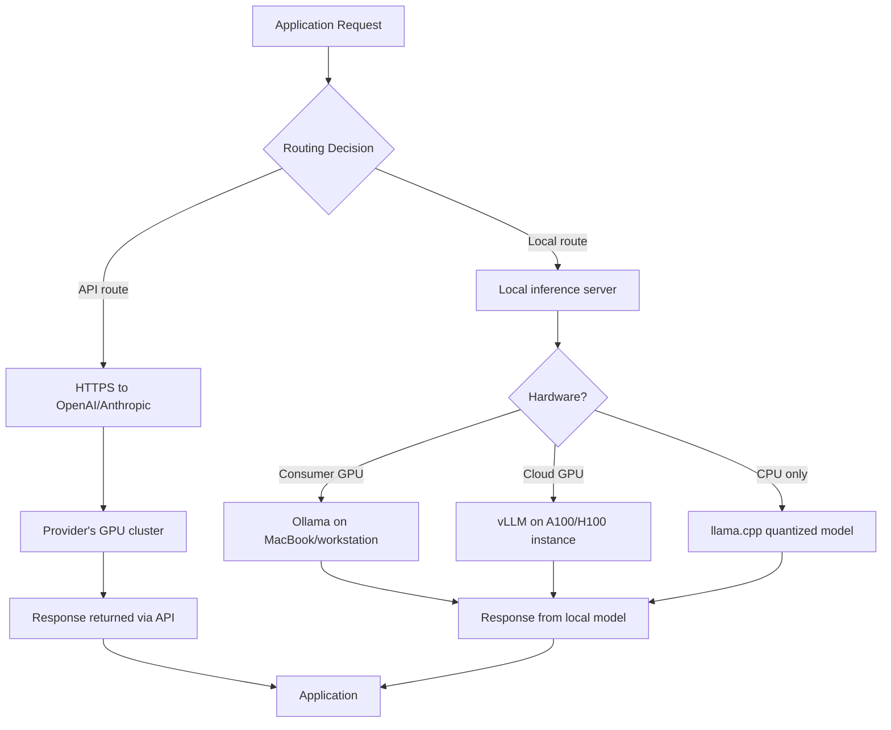

# API vs Local LLM: Which Should You Use?

The most common point of confusion when building with LLMs is whether to use a hosted API (OpenAI, Anthropic, Gemini) or run a model locally (Ollama, vLLM, self-hosted on GPU instances). The default answer in most tutorials is "use the API" — and for many use cases, that is correct. But there is a real class of applications where local deployment is the right engineering decision, and conflating the two leads to either paying too much or deploying a model that does not meet requirements.

The decision is not primarily about technical preference. It comes down to three variables: cost at your usage scale, latency requirements, and data privacy constraints. Get those three right, and the choice usually becomes obvious.

I have seen teams run $40,000/month API bills for workloads that could run on $8,000/month of GPU instances with comparable quality. I have also seen teams spend months setting up self-hosted infrastructure for an application that generates 50 API calls per day. Both mistakes are avoidable with clear analysis upfront.

---

## Concept Overview

**API LLMs** (OpenAI, Anthropic Claude, Google Gemini):
- Model runs on provider's infrastructure
- You pay per token consumed
- No infrastructure management
- Access to frontier models (GPT-4o, Claude 3.5 Sonnet)
- Data sent to third-party servers

**Local/Self-hosted LLMs** (Ollama, vLLM, llama.cpp, self-managed GPU):
- Model runs on your hardware or cloud GPU instances
- Fixed infrastructure cost (GPU hours or hardware amortization)
- Full infrastructure responsibility
- Open-source models (Llama 3.1, Mistral, Qwen, DeepSeek)
- Data never leaves your environment

**Key capability gap (2026):** Frontier API models still outperform the best open-source alternatives on complex reasoning, instruction following, and coding tasks. The gap has narrowed significantly — Llama 3.1 70B and Qwen 2.5 72B are genuinely competitive on many benchmarks — but it has not closed. For tasks requiring the absolute best output quality, API models maintain an advantage.

---

## How It Works



---

## Implementation Example

### Using Ollama for Local Inference

Ollama is the easiest way to run open-source models locally. It handles model downloading, quantization, and serving with an OpenAI-compatible API endpoint.

```bash
# Install Ollama
curl -fsSL https://ollama.ai/install.sh | sh

# Pull and run Llama 3.1 8B
ollama pull llama3.1:8b

# Pull Qwen 2.5 Coder for code tasks
ollama pull qwen2.5-coder:7b

# Ollama serves on localhost:11434 by default
```

```python
import httpx
import json

OLLAMA_BASE_URL = "http://localhost:11434"

def ollama_chat(
    prompt: str,
    model: str = "llama3.1:8b",
    system: str = "",
    temperature: float = 0.7
) -> str:
    """Chat with a local Ollama model."""
    messages = []
    if system:
        messages.append({"role": "system", "content": system})
    messages.append({"role": "user", "content": prompt})

    response = httpx.post(
        f"{OLLAMA_BASE_URL}/api/chat",
        json={
            "model": model,
            "messages": messages,
            "options": {
                "temperature": temperature,
                "num_predict": 1024  # max output tokens
            },
            "stream": False
        },
        timeout=120  # Local inference can be slow on CPU
    )
    response.raise_for_status()
    return response.json()["message"]["content"]

# OpenAI-compatible API (drop-in replacement)
from openai import OpenAI

ollama_client = OpenAI(
    base_url="http://localhost:11434/v1",
    api_key="ollama"  # Required but ignored by Ollama
)

def ollama_openai_compatible(prompt: str, model: str = "llama3.1:8b") -> str:
    """Use OpenAI SDK against Ollama's OpenAI-compatible endpoint."""
    response = ollama_client.chat.completions.create(
        model=model,
        messages=[{"role": "user", "content": prompt}],
        max_tokens=1024,
        temperature=0
    )
    return response.choices[0].message.content
```

### Unified Client — API and Local with Same Interface

```python
from openai import OpenAI
from enum import Enum

class LLMProvider(Enum):
    OPENAI = "openai"
    OLLAMA = "ollama"

class UnifiedLLMClient:
    """Single interface for both OpenAI API and Ollama local models."""

    def __init__(self, provider: LLMProvider = LLMProvider.OPENAI):
        self.provider = provider

        if provider == LLMProvider.OPENAI:
            self.client = OpenAI()
            self.default_model = "gpt-4o-mini"
        elif provider == LLMProvider.OLLAMA:
            self.client = OpenAI(
                base_url="http://localhost:11434/v1",
                api_key="ollama"
            )
            self.default_model = "llama3.1:8b"

    def chat(
        self,
        messages: list[dict],
        model: str = None,
        temperature: float = 0,
        max_tokens: int = 1024
    ) -> str:
        model = model or self.default_model
        response = self.client.chat.completions.create(
            model=model,
            messages=messages,
            temperature=temperature,
            max_tokens=max_tokens,
            timeout=120 if self.provider == LLMProvider.OLLAMA else 30
        )
        return response.choices[0].message.content

# Switch providers by changing one line
openai_client = UnifiedLLMClient(LLMProvider.OPENAI)
ollama_client = UnifiedLLMClient(LLMProvider.OLLAMA)

prompt = [{"role": "user", "content": "Write a Python function to find prime numbers up to N."}]
print("OpenAI:", openai_client.chat(prompt))
print("Ollama:", ollama_client.chat(prompt))
```

### Cost Comparison Calculator

```python
def calculate_monthly_api_cost(
    daily_requests: int,
    avg_input_tokens: int,
    avg_output_tokens: int,
    model: str = "gpt-4o-mini"
) -> dict:
    """Calculate monthly API cost."""
    pricing = {
        "gpt-4o": {"input": 2.50, "output": 10.00},
        "gpt-4o-mini": {"input": 0.15, "output": 0.60},
        "claude-3-5-sonnet": {"input": 3.00, "output": 15.00},
        "claude-3-haiku": {"input": 0.25, "output": 1.25},
    }

    if model not in pricing:
        raise ValueError(f"Unknown model: {model}")

    prices = pricing[model]
    monthly_requests = daily_requests * 30

    monthly_cost = (
        (avg_input_tokens / 1_000_000) * prices["input"] +
        (avg_output_tokens / 1_000_000) * prices["output"]
    ) * monthly_requests

    return {
        "model": model,
        "monthly_requests": monthly_requests,
        "monthly_cost_usd": monthly_cost,
        "cost_per_request_cents": (monthly_cost / monthly_requests) * 100
    }

def calculate_gpu_cost(
    daily_requests: int,
    avg_response_time_seconds: float,
    gpu_instance_hourly_usd: float = 3.50,  # A10G on AWS
    model_tokens_per_second: float = 50.0   # Llama 3.1 8B on A10G
) -> dict:
    """Calculate monthly GPU hosting cost for self-hosted model."""
    # GPU utilization based on workload
    daily_compute_seconds = daily_requests * avg_response_time_seconds
    utilization = min(daily_compute_seconds / (24 * 3600), 1.0)

    # At low utilization, you still pay for the idle GPU
    # This is the key cost trap for small workloads
    monthly_gpu_cost = gpu_instance_hourly_usd * 24 * 30
    monthly_cost = monthly_gpu_cost  # Fixed cost regardless of usage

    return {
        "instance": "A10G GPU",
        "gpu_utilization_pct": utilization * 100,
        "monthly_cost_usd": monthly_cost,
        "cost_per_request_cents": (monthly_cost / (daily_requests * 30)) * 100
    }

# Example: 10,000 requests/day, 500 input tokens, 300 output tokens

api_cost = calculate_monthly_api_cost(10_000, 500, 300, "gpt-4o-mini")
print(f"GPT-4o-mini API cost: ${api_cost['monthly_cost_usd']:.2f}/month")
# → ~$225/month

api_cost_4o = calculate_monthly_api_cost(10_000, 500, 300, "gpt-4o")
print(f"GPT-4o API cost: ${api_cost_4o['monthly_cost_usd']:.2f}/month")
# → ~$3,750/month

gpu_cost = calculate_gpu_cost(10_000, 6.0, gpu_instance_hourly_usd=3.50)
print(f"A10G self-hosted cost: ${gpu_cost['monthly_cost_usd']:.2f}/month")
# → ~$2,520/month (always-on A10G)
print(f"GPU utilization: {gpu_cost['gpu_utilization_pct']:.1f}%")
# → ~69% utilization at 10K req/day
```

---

## Real Cost Analysis

**Scenario 1: Low traffic (1,000 requests/day, 500 input + 300 output tokens)**

| Option | Monthly Cost |
|--------|-------------|
| GPT-4o-mini API | $22.50 |
| GPT-4o API | $375 |
| A10G self-hosted (always-on) | $2,520 |
| A10G self-hosted (spot, 8h/day) | $840 |
| Mac Studio M2 Ultra (hardware amortized) | ~$150/month amortized |

**Verdict:** API wins decisively at low traffic. GPU hosting has a fixed floor cost that makes it uneconomical below 5K–10K requests/day.

**Scenario 2: High traffic (500,000 requests/day, 500 input + 300 output tokens)**

| Option | Monthly Cost |
|--------|-------------|
| GPT-4o-mini API | $11,250 |
| GPT-4o API | $187,500 |
| 4× A100 self-hosted (covering peak load) | ~$35,000 |
| 4× A100 on reserved instances (1-year) | ~$22,000 |

**Verdict:** At 500K requests/day, self-hosting a capable open-source model becomes significantly cheaper than GPT-4o-mini if quality is acceptable. GPT-4o at this scale is cost-prohibitive for most applications.

---

## Decision Framework

**Use the API when:**
- Less than 50,000 requests/day (API unit economics almost always win)
- You need frontier model capability (GPT-4o, Claude 3.5 Sonnet)
- Data privacy is not a concern (or you use API with Data Processing Agreements)
- Your team does not have MLOps experience
- You want zero infrastructure management
- Rapid prototyping and variable traffic

**Use a local/self-hosted model when:**
- Processing sensitive data (PII, financial records, healthcare) that cannot leave your environment
- Traffic exceeds 100K+ requests/day and quality requirements can be met by open-source models
- Latency requirements demand sub-100ms responses at scale (co-located inference)
- You need to customize or fine-tune the model on proprietary data
- Regulatory requirements prohibit third-party data processing (HIPAA, GDPR, FedRAMP)

**Hybrid approach (common in production):**
- Use API for user-facing complex queries
- Use local model for high-frequency, simpler internal processing (classification, extraction)
- Route based on data sensitivity: sensitive requests to local model, non-sensitive to API

---

## Best Practices

**Benchmark your specific tasks, not just overall model quality.** MMLU benchmarks are not your use case. Take 100 representative inputs from your application, run them through both the API model and your candidate local model, and evaluate outputs. Quality gaps on benchmarks often do not translate to gaps on specific tasks.

**Account for infrastructure overhead in self-hosted cost.** GPU compute is not the only cost of self-hosting. Add: ML engineer time for deployment and maintenance, monitoring infrastructure, model update management, redundancy (your SLA requires replicas), and networking. Real total cost of ownership is typically 1.5–2x the raw GPU compute cost.

**Use quantized models for cost-efficient local inference.** 4-bit quantized versions of Llama 3.1 70B run on consumer hardware (24GB VRAM) at a fraction of the cost of a 16-bit deployment with minimal quality degradation for most tasks.

**Implement model fallback.** Route to a local model first; fall back to the API for failures, low-confidence outputs, or complex queries. This pattern captures most of the cost savings while maintaining quality guarantees.

---

## Common Mistakes

1. **Underestimating self-hosted infrastructure cost.** GPU compute is just the starting point. Monitoring, redundancy, MLOps tooling, and engineer time often double the total cost. Factor these in before declaring self-hosting cheaper.

2. **Assuming open-source models are free.** They are free to download, not free to run. A 70B parameter model requires significant GPU memory and compute. Llama 3.1 70B requires 2× A100 80GB GPUs for efficient inference at f16 precision.

3. **Not benchmarking on your actual task.** Switching from GPT-4o to Llama 3.1 8B and assuming comparable output is wrong for most complex tasks. Measure quality on your specific use case before making the switch.

4. **Ignoring latency at low GPU utilization.** A local model on an undersized GPU (or running on CPU) can be dramatically slower than the API. If your local model takes 30 seconds to respond when the API takes 2 seconds, "free" compute is not a good trade.

5. **Missing the break-even calculation.** Many teams switch to self-hosting before they hit the break-even point. Do the math: at what request volume does self-hosting become cheaper than the API? Calculate this before investing engineering time.

---

## Summary

The API vs local LLM decision comes down to three variables: scale (API wins below ~50K requests/day), privacy requirements (local wins when data cannot leave your environment), and capability needs (frontier API models still lead on complex tasks). At high traffic with acceptable open-source model quality, self-hosting becomes significantly cheaper. For most applications below 100K daily requests that do not handle sensitive data, the OpenAI or Anthropic API is the pragmatic choice.

---

## Related Articles

- [LLM APIs Guide for Developers](/blog/llm-api-guide/)
- [LLM API Cost Optimization: Reduce Costs by 60%+](/blog/llm-api-cost-optimization/)
- [How LLMs Work](/blog/how-llms-work/)
- [AI Learning Roadmap](/blog/ai-learning-roadmap/)

---

## FAQ

**Q: Can Llama 3.1 or Mistral replace GPT-4o for production use?**

For specific tasks, yes. Text classification, summarization, structured extraction, and code generation for common languages often work well with Llama 3.1 70B or Qwen 2.5 72B. For complex multi-step reasoning, nuanced instruction following, or cutting-edge coding tasks, GPT-4o and Claude 3.5 Sonnet maintain a meaningful quality advantage as of early 2026.

**Q: What hardware do I need to run a 70B parameter model?**

At 4-bit quantization (GGUF format via llama.cpp or Ollama): ~40GB VRAM — achievable on 2× RTX 4090 (24GB each) or 1× A100 80GB. At full f16 precision: ~140GB VRAM — requires multiple A100 or H100 GPUs. For most teams, 4-bit quantized 70B on cloud GPU instances is the practical starting point.

**Q: Is running LLMs locally truly private?**

Yes — the model weights and inference run entirely on your hardware. No data is sent to external servers. This is why local deployment is the right choice for HIPAA-covered healthcare data, financial PII, and other regulated categories.

**Q: How does Ollama compare to vLLM for production?**

Ollama is designed for ease of use — great for development and moderate traffic. vLLM is a production inference engine with batching, quantization, and much higher throughput per GPU. For serious production deployments (thousands of requests per hour), vLLM significantly outperforms Ollama on throughput and token generation speed.

**Q: What is the minimum request volume where self-hosting makes financial sense?**

Rough calculation: if your API bill exceeds $2,500–$3,000/month, a single A10G GPU instance (~$2,520/month on-demand, ~$1,500/month reserved) running a capable open-source model at high utilization may be cheaper. But this only holds if quality is acceptable. Below that threshold, the operational overhead of self-hosting outweighs the savings.

---

<script type="application/ld+json">
{
  "@context": "https://schema.org",
  "@type": "FAQPage",
  "mainEntity": [
    {
      "@type": "Question",
      "name": "Can Llama 3.1 or Mistral replace GPT-4o for production use?",
      "acceptedAnswer": {
        "@type": "Answer",
        "text": "For specific tasks, yes — classification, summarization, and structured extraction often work well with Llama 3.1 70B. For complex multi-step reasoning and cutting-edge coding, GPT-4o and Claude 3.5 Sonnet maintain a quality advantage as of 2026."
      }
    },
    {
      "@type": "Question",
      "name": "What hardware do I need to run a 70B parameter model?",
      "acceptedAnswer": {
        "@type": "Answer",
        "text": "At 4-bit quantization: ~40GB VRAM, achievable on 2× RTX 4090 or 1× A100 80GB. At full f16 precision: ~140GB VRAM, requiring multiple A100 or H100 GPUs."
      }
    },
    {
      "@type": "Question",
      "name": "Is running LLMs locally truly private?",
      "acceptedAnswer": {
        "@type": "Answer",
        "text": "Yes — model weights and inference run entirely on your hardware with no data sent to external servers. This makes local deployment the right choice for HIPAA-covered healthcare data, financial PII, and other regulated categories."
      }
    },
    {
      "@type": "Question",
      "name": "What is the minimum request volume where self-hosting makes financial sense?",
      "acceptedAnswer": {
        "@type": "Answer",
        "text": "Rough threshold: when your API bill exceeds $2,500-3,000/month, a single A10G GPU instance may be cheaper. But only if quality requirements can be met by open-source models and operational overhead is manageable."
      }
    }
  ]
}
</script>
