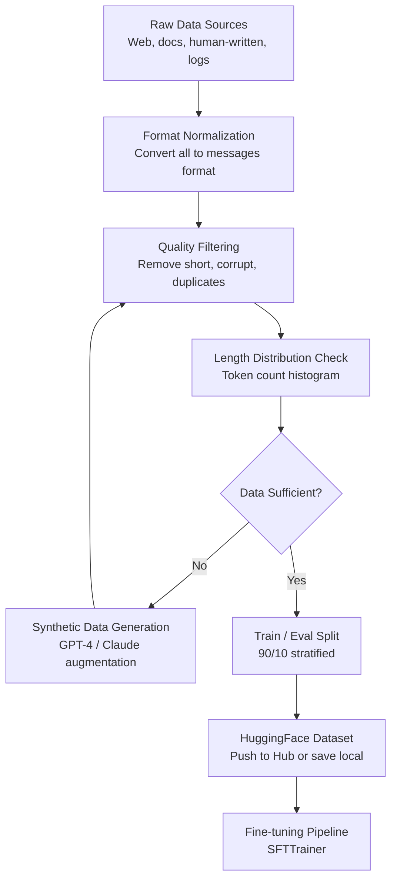

# Dataset Preparation for LLM Fine-Tuning

Most fine-tuning failures are dataset failures. The training code is almost never the problem — SFTTrainer, Unsloth, and standard PEFT pipelines are well-tested and work reliably. The model and the training config matter, but within a reasonable range, quality differences from hyperparameter tuning are modest. Dataset quality, on the other hand, is the primary variable that separates fine-tuned models that work in production from ones that don't.

I've reviewed fine-tuning projects where engineers spent two weeks tuning learning rates and LoRA ranks while the training data contained formatting inconsistencies, duplicate examples, and outputs written at the wrong level of detail. Fixing the data took a day and produced a better model than all the hyperparameter experiments combined.

This guide covers the full dataset pipeline: format selection, sourcing, quality filtering, deduplication, and synthetic data generation. All code is practical and runnable.

## Concept Overview

LLM fine-tuning datasets are instruction-response pairs. The fundamental question is: what does "good" look like for your task, and do your training examples faithfully represent that?

**Three main data formats:**

**Alpaca format** (single-turn, optional context):
```json
{
  "instruction": "Translate this English text to French",
  "input": "The weather is beautiful today.",
  "output": "Le temps est magnifique aujourd'hui."
}
```

**ShareGPT format** (multi-turn conversations):
```json
{
  "conversations": [
    {"from": "human", "value": "What is gradient descent?"},
    {"from": "gpt",   "value": "Gradient descent is an optimization algorithm..."},
    {"from": "human", "value": "How does the learning rate affect it?"},
    {"from": "gpt",   "value": "The learning rate controls step size..."}
  ]
}
```

**OpenAI messages format** (recommended for modern models):
```json
{
  "messages": [
    {"role": "system", "content": "You are a data science tutor."},
    {"role": "user",   "content": "What is gradient descent?"},
    {"role": "assistant", "content": "Gradient descent is an optimization algorithm..."}
  ]
}
```

The OpenAI messages format is the standard in 2026. All major model families (Llama, Mistral, Phi, Gemma, Qwen) have official chat templates that expect this format. Use it unless you have a specific reason not to.

**Data quantity guidelines by task:**

| Task Type | Minimum | Target | Notes |
|-----------|---------|--------|-------|
| Output format enforcement | 200–500 | 1,000 | Short, repetitive — easy to overfit |
| Style/tone adaptation | 500–1,000 | 2,000–5,000 | Needs diversity of topics |
| Domain-specific QA | 1,000–2,000 | 5,000–10,000 | Cover edge cases |
| Code generation | 2,000–5,000 | 10,000+ | Wide variety of problems |
| General instruction following | 10,000+ | 50,000+ | Broad coverage required |

## How It Works



In practice, the filtering and synthetic generation steps are iterative. You filter, discover you have 400 examples after filtering (not enough), generate synthetic data, filter the synthetic data, and then combine.

## Implementation Example

### Step 1: Load and Normalize Data from Multiple Sources

```python
import json
from datasets import Dataset, concatenate_datasets, load_dataset
from typing import Optional

def normalize_to_messages(example: dict, source_format: str) -> Optional[dict]:
    """Convert any format to the standard messages format."""

    if source_format == "alpaca":
        instruction = example.get("instruction", "").strip()
        context = example.get("input", "").strip()
        output = example.get("output", "").strip()

        if not instruction or not output:
            return None

        user_content = f"{instruction}\n\n{context}".strip() if context else instruction

        return {
            "messages": [
                {"role": "user",      "content": user_content},
                {"role": "assistant", "content": output}
            ]
        }

    elif source_format == "sharegpt":
        conversations = example.get("conversations", [])
        messages = []
        role_map = {"human": "user", "gpt": "assistant", "system": "system"}

        for turn in conversations:
            role = role_map.get(turn.get("from", ""), None)
            value = turn.get("value", "").strip()
            if role and value:
                messages.append({"role": role, "content": value})

        # Must have at least one user and one assistant turn
        roles = {m["role"] for m in messages}
        if "user" not in roles or "assistant" not in roles:
            return None

        return {"messages": messages}

    elif source_format == "messages":
        messages = example.get("messages", [])
        if len(messages) < 2:
            return None
        return {"messages": messages}

    return None

# Load from multiple sources and normalize
sources = [
    ("path/to/alpaca_data.jsonl", "alpaca"),
    ("path/to/sharegpt_data.jsonl", "sharegpt"),
]

all_examples = []
for filepath, fmt in sources:
    with open(filepath) as f:
        for line in f:
            example = json.loads(line)
            normalized = normalize_to_messages(example, fmt)
            if normalized:
                all_examples.append(normalized)

print(f"Total normalized examples: {len(all_examples)}")
raw_dataset = Dataset.from_list(all_examples)
```

### Step 2: Quality Filtering

```python
from transformers import AutoTokenizer
import re

tokenizer = AutoTokenizer.from_pretrained("meta-llama/Meta-Llama-3-8B-Instruct")

def compute_token_count(example):
    """Tokenize and count tokens for the full conversation."""
    text = tokenizer.apply_chat_template(
        example["messages"], tokenize=False, add_generation_prompt=False
    )
    tokens = tokenizer.encode(text)
    return {"token_count": len(tokens), "formatted_text": text}

def is_high_quality(example):
    """Filter out low-quality examples."""
    messages = example["messages"]

    # Get assistant responses
    assistant_turns = [m for m in messages if m["role"] == "assistant"]
    user_turns = [m for m in messages if m["role"] == "user"]

    if not assistant_turns or not user_turns:
        return False

    for turn in assistant_turns:
        content = turn["content"].strip()

        # Filter: too short (likely incomplete)
        if len(content) < 50:
            return False

        # Filter: too long (may be junk data)
        if len(content) > 4000:
            return False

        # Filter: repetitive content (sign of model collapse in synthetic data)
        words = content.split()
        if len(words) > 20:
            unique_word_ratio = len(set(words)) / len(words)
            if unique_word_ratio < 0.4:
                return False

        # Filter: known low-quality patterns
        bad_patterns = [
            r"As an AI language model,? I (can't|cannot|don't|am unable)",
            r"I'm sorry,? but I (can't|cannot|am not able to)",
            r"^Sure!? Here (is|are)",  # Sycophantic openers
        ]
        for pattern in bad_patterns:
            if re.search(pattern, content, re.IGNORECASE):
                return False

    # Filter: token count bounds
    if example.get("token_count", 0) < 50 or example.get("token_count", 0) > 2048:
        return False

    return True

# Apply quality filters
print("Computing token counts...")
dataset = raw_dataset.map(compute_token_count, desc="Tokenizing")

print("Filtering...")
before = len(dataset)
dataset = dataset.filter(is_high_quality, desc="Quality filtering")
after = len(dataset)
print(f"After filtering: {after}/{before} examples retained ({100*after/before:.1f}%)")
```

### Step 3: Deduplication

```python
import hashlib

def compute_hash(example):
    """Hash first user message for near-duplicate detection."""
    first_user = next(
        (m["content"] for m in example["messages"] if m["role"] == "user"), ""
    )
    # Normalize: lowercase, remove extra whitespace
    normalized = " ".join(first_user.lower().split())
    hash_val = hashlib.md5(normalized.encode()).hexdigest()
    return {"content_hash": hash_val}

dataset = dataset.map(compute_hash)

# Remove exact duplicates based on hash
seen_hashes = set()
def is_not_duplicate(example):
    h = example["content_hash"]
    if h in seen_hashes:
        return False
    seen_hashes.add(h)
    return True

before = len(dataset)
dataset = dataset.filter(is_not_duplicate)
after = len(dataset)
print(f"After deduplication: {after}/{before} ({(before-after)} duplicates removed)")
```

### Step 4: Synthetic Data Generation with GPT-4

```python
from openai import OpenAI

client = OpenAI()

DOMAIN = "Python backend development"
SEED_TOPICS = [
    "async/await patterns",
    "database connection pooling",
    "FastAPI dependency injection",
    "Redis caching strategies",
    "Docker containerization",
    "error handling best practices",
    "JWT authentication",
    "rate limiting",
]

def generate_instruction_pair(topic: str) -> Optional[dict]:
    """Generate a high-quality instruction-response pair for a topic."""

    meta_prompt = f"""You are creating training data for a {DOMAIN} AI assistant.

Generate ONE detailed, realistic technical question about {topic} that a senior developer might ask.
Then write an expert answer that is specific, technically accurate, and immediately useful.

Format your response as JSON:
{{
    "instruction": "the technical question here",
    "output": "the detailed expert answer here"
}}

Requirements:
- The question must be specific and practical, not vague
- The answer must be at least 150 words
- Include code examples where appropriate
- Do not start the answer with "Sure!" or "Of course!"
- Do not mention that you are an AI"""

    try:
        response = client.chat.completions.create(
            model="gpt-4o",
            messages=[{"role": "user", "content": meta_prompt}],
            temperature=0.8,
            response_format={"type": "json_object"},
        )

        data = json.loads(response.choices[0].message.content)

        if len(data.get("instruction", "")) < 20:
            return None
        if len(data.get("output", "")) < 100:
            return None

        return {
            "messages": [
                {"role": "system", "content": f"You are an expert {DOMAIN} engineer."},
                {"role": "user",   "content": data["instruction"]},
                {"role": "assistant", "content": data["output"]},
            ]
        }

    except Exception as e:
        print(f"Generation error for topic '{topic}': {e}")
        return None

# Generate 1,000 synthetic examples
synthetic_examples = []
target = 1000
examples_per_topic = target // len(SEED_TOPICS)

for topic in SEED_TOPICS:
    topic_examples = 0
    attempts = 0
    print(f"Generating for topic: {topic}")

    while topic_examples < examples_per_topic and attempts < examples_per_topic * 3:
        example = generate_instruction_pair(topic)
        attempts += 1
        if example:
            synthetic_examples.append(example)
            topic_examples += 1

    print(f"  Generated {topic_examples}/{examples_per_topic}")

print(f"\nTotal synthetic examples generated: {len(synthetic_examples)}")
synthetic_dataset = Dataset.from_list(synthetic_examples)
```

### Step 5: Combine, Split, and Save

```python
# Combine real and synthetic data
final_dataset = concatenate_datasets([dataset, synthetic_dataset])
print(f"Final dataset size: {len(final_dataset)}")

# Stratified split
split = final_dataset.train_test_split(test_size=0.1, seed=42)
train_ds = split["train"]
eval_ds  = split["test"]

print(f"Train: {len(train_ds)}, Eval: {len(eval_ds)}")

# Add formatted text column for SFTTrainer
def add_formatted_text(example):
    text = tokenizer.apply_chat_template(
        example["messages"], tokenize=False, add_generation_prompt=False
    )
    return {"text": text}

train_ds = train_ds.map(add_formatted_text)
eval_ds  = eval_ds.map(add_formatted_text)

# Save locally
train_ds.to_json("./data/train.jsonl")
eval_ds.to_json("./data/eval.jsonl")

# Optionally push to HuggingFace Hub
# train_ds.push_to_hub("your-username/your-dataset-name", split="train")

print("Dataset saved.")

# Print token count statistics
import numpy as np
token_counts = [len(tokenizer.encode(ex["text"])) for ex in train_ds]
print(f"\nToken count statistics:")
print(f"  Min: {min(token_counts)}")
print(f"  Max: {max(token_counts)}")
print(f"  Mean: {np.mean(token_counts):.0f}")
print(f"  Median: {np.median(token_counts):.0f}")
print(f"  95th percentile: {np.percentile(token_counts, 95):.0f}")
```

## Best Practices

**Quality over quantity, measurably.** Before finalizing your dataset, manually review 50 random examples. If you find problems in more than 10% of them, your filtering is insufficient. It is faster to invest time in filtering than to discover quality issues after a training run.

**Set `max_seq_length` based on the 95th percentile of your token count distribution.** If 95% of examples are under 1,024 tokens, setting `max_seq_length=2048` wastes memory and slows training. Truncation at the 95th percentile loses very little data while improving training efficiency.

**Log your data pipeline decisions.** Record how many examples were removed at each filtering step. When you update the dataset, you need to know whether a quality change came from new data, different filtering, or training config changes.

**Validate distribution balance.** If 80% of your examples cover one topic, the model will be disproportionately good at that topic. Check distribution with simple category labeling before training.

## Common Mistakes

1. **Not verifying that outputs don't leak the instruction format.** If your training output accidentally contains the user's question restated before the actual answer, the model will learn this behavior. Check the formatted text, not just the raw JSON.

2. **Generating synthetic data with the same temperature across all topics.** Complex technical topics benefit from lower temperature (0.5–0.7) for accuracy. Creative or diverse topics benefit from higher temperature (0.8–1.0). Using a flat temperature often produces bland data for creative tasks and hallucinated data for technical ones.

3. **Including outputs that exceed `max_seq_length` without truncation warning.** SFTTrainer silently truncates examples that exceed `max_seq_length`. If your responses are long and getting truncated, the model trains on incomplete outputs — which can produce cut-off responses at inference time.

4. **Mixing system prompts and no-system-prompt examples without awareness.** If some training examples have system prompts and others don't, the model will behave differently with and without a system prompt at inference. Decide on a convention and apply it consistently.

5. **Using low-quality public datasets without review.** Many popular instruction datasets (early Alpaca variants, some ShareGPT datasets) contain factual errors, inconsistent style, and poor-quality responses. Always review a sample before including any public dataset.

## Summary

Dataset preparation is the highest-leverage activity in the fine-tuning pipeline. Format your data consistently using the model's chat template, filter aggressively for quality, deduplicate to prevent the model from memorizing specific examples, and generate synthetic data when volume is insufficient. The token count distribution determines your `max_seq_length` setting and directly affects training efficiency.

For most fine-tuning projects, 500–2,000 high-quality examples is enough to produce meaningful behavioral change. The filtering and normalization steps in this guide are the difference between a dataset that looks right and one that trains correctly.

## Related Articles

- [LLM Fine-Tuning Guide: LoRA, QLoRA, and Full Fine-Tuning](/blog/llm-fine-tuning-guide/) — Complete pipeline from data to deployed model
- [Instruction Tuning Explained](/blog/instruction-tuning/) — How data format affects instruction-following behavior
- [Synthetic Data for LLM Training](/blog/synthetic-data-llm/) — Full synthetic generation pipeline with quality filtering
- [LLM Evaluation Metrics](/blog/llm-evaluation/) — How to measure whether your fine-tuned model improved
- [RAG Architecture Guide](/blog/rag-architecture-guide/) — Alternative to fine-tuning for knowledge-intensive tasks

## FAQ

**Should I use a public dataset or collect my own data?**
Start with your own data for domain-specific tasks — it will always be more relevant. Public datasets (Dolly, OpenHermes, Capybara) are useful for augmenting general instruction-following capability but may dilute domain-specific performance. The best approach is usually a base of real examples augmented with synthetic data.

**How do I handle imbalanced datasets?**
If some categories have many more examples than others, either oversample the underrepresented categories or cap the overrepresented ones. Weighted sampling during training (via a custom data sampler) is also an option but adds complexity. Simple truncation of dominant categories is often sufficient.

**How much does it cost to generate 1,000 synthetic examples with GPT-4?**
Using GPT-4o at roughly 500 input tokens and 300 output tokens per example: 1,000 × 800 tokens ÷ 1M × $5 = $4 for output, plus $2.50 for input. Budget roughly $5–15 for 1,000 examples with GPT-4o, depending on prompt length and response length.

**What is the best way to check if my data is high quality?**
Train on a small subset (200–300 examples) first and generate test outputs. If the model already produces reasonable outputs from 200 examples, the data format and quality are correct. If the outputs are clearly wrong or incoherent with 200 examples, the data has quality issues that more data will not fix.

<script type="application/ld+json">
{
  "@context": "https://schema.org",
  "@type": "FAQPage",
  "mainEntity": [
    {
      "@type": "Question",
      "name": "Should I use a public dataset or collect my own data?",
      "acceptedAnswer": {
        "@type": "Answer",
        "text": "Start with your own data for domain-specific tasks — it will always be more relevant. Public datasets are useful for augmenting general instruction-following but may dilute domain performance. The best approach is real examples augmented with synthetic data."
      }
    },
    {
      "@type": "Question",
      "name": "How much does it cost to generate 1,000 synthetic examples with GPT-4?",
      "acceptedAnswer": {
        "@type": "Answer",
        "text": "Using GPT-4o at roughly 800 tokens per example: 1,000 examples costs approximately $5–15 depending on prompt and response length."
      }
    },
    {
      "@type": "Question",
      "name": "What is the best way to check if my data is high quality?",
      "acceptedAnswer": {
        "@type": "Answer",
        "text": "Train on a small subset (200–300 examples) first and generate test outputs. If the model produces reasonable outputs from 200 examples, data format and quality are correct. If outputs are wrong or incoherent, more data will not fix the underlying quality issue."
      }
    },
    {
      "@type": "Question",
      "name": "How do I handle imbalanced datasets?",
      "acceptedAnswer": {
        "@type": "Answer",
        "text": "Either oversample underrepresented categories or cap overrepresented ones. Weighted sampling during training via a custom data sampler is also an option. Simple truncation of dominant categories is often sufficient for most use cases."
      }
    }
  ]
}
</script>
