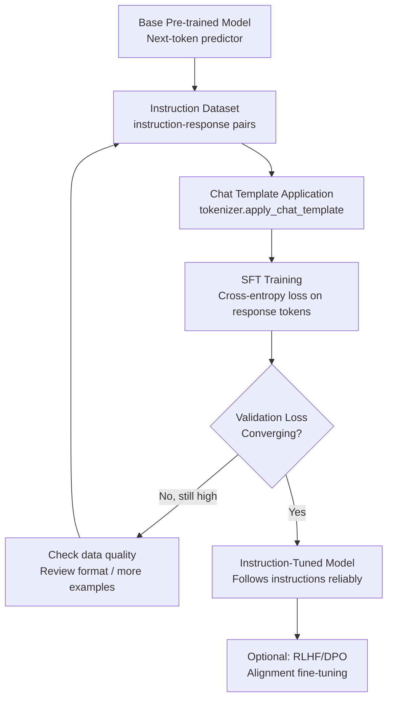

# Instruction Tuning Explained: How LLMs Learn to Follow Instructions

A base language model — the raw output of pre-training — is a next-token predictor. It is very good at completing text that looks like the internet. Ask it a question, and it might complete the question rather than answer it, or answer in a style more typical of a web document than a conversational response. Base models are powerful but raw.

Instruction tuning is the step that bridges this gap. It fine-tunes the pre-trained model on a dataset of instruction-response pairs, teaching the model to recognize when it is being asked to do something and respond helpfully. Every commercial "assistant" model — GPT-4, Claude, Gemini — started as a base model and was instruction-tuned before deployment.

Understanding instruction tuning matters for practitioners because it directly informs how to format fine-tuning datasets. If you are using SFTTrainer and your fine-tuned model behaves unexpectedly, the formatting of your training data — specifically how you apply the chat template — is almost always the culprit.

## Concept Overview

Pre-training teaches the model to model language — to assign high probability to coherent, grammatical, and factually consistent continuations. It does not teach the model to act as an assistant. A pre-trained model completing "What is the capital of France?" will likely generate "What is the capital of Italy? What is the capital of Germany?" because question lists are common in the pre-training corpus.

Instruction tuning solves this with supervised fine-tuning (SFT): training on examples of (instruction, good response) pairs. The model learns the pattern "when I see an instruction in this format, I generate a helpful response in that format."

**Three core dataset formats:**

The **Alpaca format** was popularized by Stanford's Alpaca project. Each example has an instruction, optional context input, and output:
```json
{"instruction": "Summarize this text", "input": "...", "output": "..."}
```

The **ShareGPT format** represents multi-turn conversations as a list of message dictionaries:
```json
{"conversations": [{"from": "human", "value": "..."}, {"from": "gpt", "value": "..."}]}
```

The **OpenAI chat format** (now the standard) uses role-labeled messages:
```json
{"messages": [{"role": "user", "content": "..."}, {"role": "assistant", "content": "..."}]}
```

Modern instruction-tuned models use the third format, applied through each model's specific chat template. Using the wrong format or ignoring the chat template is the single most common cause of poor fine-tuning results.

## How It Works



The key implementation detail is in the loss computation. During SFT, we compute cross-entropy loss only on the response tokens — not on the instruction tokens. The model needs to learn to generate the response, not to predict the instruction. SFTTrainer handles this automatically when using the chat template format with `completion_only` training.

## Implementation Example

### Step 1: Install and Import

```bash
pip install trl transformers peft datasets unsloth accelerate
```

```python
from unsloth import FastLanguageModel
from trl import SFTTrainer, SFTConfig, DataCollatorForCompletionOnlyLM
from datasets import load_dataset, Dataset
from transformers import AutoTokenizer
import torch
import json
```

### Step 2: Prepare Your Instruction Dataset

```python
# Example: creating a dataset for customer support instruction tuning
# Your data should cover diverse instruction types within your domain

raw_examples = [
    {
        "system": "You are a customer support agent for an e-commerce platform.",
        "instruction": "A customer says: 'My order hasn't arrived after 2 weeks.' How do you respond?",
        "output": "I'm sorry to hear your order hasn't arrived. Let me look into this right away. Could you please provide your order number? I'll check the shipping status and work with our logistics team to resolve this for you. If the package is lost, we'll arrange a replacement or full refund according to your preference."
    },
    {
        "system": "You are a customer support agent for an e-commerce platform.",
        "instruction": "A customer wants to return a product they bought 45 days ago. Our policy allows 30-day returns.",
        "output": "Thank you for reaching out. Our standard return policy covers purchases within 30 days of delivery, and I can see your purchase falls outside that window. However, I'd like to review your account history and see if there are any exceptions we can offer. Could you share what issue you're experiencing with the product? For defective items, we sometimes extend this window."
    },
    # ... add 500+ examples like these
]

dataset = Dataset.from_list(raw_examples)
print(f"Dataset size: {len(dataset)} examples")
```

### Step 3: Apply Chat Template Correctly

```python
model, tokenizer = FastLanguageModel.from_pretrained(
    model_name="unsloth/Meta-Llama-3-8B-Instruct",
    max_seq_length=2048,
    load_in_4bit=True,
)

def format_instruction(example):
    """
    Apply the model's exact chat template.
    Never build the template string manually — always use apply_chat_template.
    """
    messages = [
        {"role": "system", "content": example.get("system", "You are a helpful assistant.")},
        {"role": "user",   "content": example["instruction"]},
        {"role": "assistant", "content": example["output"]},
    ]
    text = tokenizer.apply_chat_template(
        messages,
        tokenize=False,
        add_generation_prompt=False,  # False for training; True for inference
    )
    return {"text": text}

dataset = dataset.map(format_instruction, remove_columns=dataset.column_names)

# Critical check: inspect the formatted output
print("Formatted training example:")
print(repr(dataset[0]["text"][:500]))
print("\nThe output section starts at:", dataset[0]["text"].find(raw_examples[0]["output"][:20]))
```

### Step 4: Multi-Turn Conversation Formatting

Multi-turn data is more powerful but requires careful formatting. Each turn's response tokens should contribute to the loss:

```python
# Multi-turn conversation dataset
multi_turn_examples = [
    {
        "conversations": [
            {"role": "system", "content": "You are a Python programming tutor."},
            {"role": "user", "content": "What is a list comprehension?"},
            {"role": "assistant", "content": "A list comprehension is a concise way to create lists in Python. The basic syntax is: `[expression for item in iterable]`. For example, `[x**2 for x in range(10)]` creates a list of squares from 0 to 81."},
            {"role": "user", "content": "Can I add conditions to it?"},
            {"role": "assistant", "content": "Yes, you can add an optional condition: `[expression for item in iterable if condition]`. For example, `[x for x in range(20) if x % 2 == 0]` gives you only even numbers. The condition filters which items from the iterable get processed."},
        ]
    },
]

def format_multi_turn(example):
    """Format multi-turn conversations — all assistant turns contribute to loss."""
    text = tokenizer.apply_chat_template(
        example["conversations"],
        tokenize=False,
        add_generation_prompt=False,
    )
    return {"text": text}

multi_turn_ds = Dataset.from_list(multi_turn_examples)
multi_turn_ds = multi_turn_ds.map(format_multi_turn, remove_columns=["conversations"])
```

### Step 5: Train with SFTTrainer

```python
model = FastLanguageModel.get_peft_model(
    model,
    r=16,
    target_modules=["q_proj", "k_proj", "v_proj", "o_proj",
                    "gate_proj", "up_proj", "down_proj"],
    lora_alpha=16,
    use_gradient_checkpointing="unsloth",
)

# Split dataset
split = dataset.train_test_split(test_size=0.1, seed=42)

training_config = SFTConfig(
    output_dir="./instruction-tuned",
    num_train_epochs=3,
    per_device_train_batch_size=2,
    per_device_eval_batch_size=2,
    gradient_accumulation_steps=4,
    warmup_ratio=0.05,
    learning_rate=2e-4,
    bf16=torch.cuda.is_bf16_supported(),
    fp16=not torch.cuda.is_bf16_supported(),
    logging_steps=10,
    eval_strategy="steps",
    eval_steps=50,
    save_strategy="steps",
    save_steps=100,
    max_seq_length=2048,
    dataset_text_field="text",
    optim="adamw_8bit",
    report_to="none",
)

trainer = SFTTrainer(
    model=model,
    tokenizer=tokenizer,
    train_dataset=split["train"],
    eval_dataset=split["test"],
    args=training_config,
)

trainer.train()
trainer.model.save_pretrained("./instruction-adapter")
tokenizer.save_pretrained("./instruction-adapter")
```

### Step 6: Test Instruction Following

```python
FastLanguageModel.for_inference(model)

def test_instruction(instruction, system="You are a helpful assistant."):
    messages = [
        {"role": "system", "content": system},
        {"role": "user",   "content": instruction},
    ]
    inputs = tokenizer.apply_chat_template(
        messages, tokenize=True, add_generation_prompt=True, return_tensors="pt"
    ).to("cuda")

    with torch.no_grad():
        output = model.generate(
            inputs,
            max_new_tokens=512,
            temperature=0.1,
            do_sample=True,
            repetition_penalty=1.1,
        )

    generated_tokens = output[0][inputs.shape[1]:]
    return tokenizer.decode(generated_tokens, skip_special_tokens=True)

# Test the instruction-tuned model
system = "You are a customer support agent for an e-commerce platform."
test_cases = [
    "My package was delivered damaged. What should I do?",
    "How do I cancel my subscription?",
    "I was charged twice for the same order.",
]

for instruction in test_cases:
    response = test_instruction(instruction, system)
    print(f"Q: {instruction}")
    print(f"A: {response}")
    print("-" * 50)
```

## Best Practices

**Write system prompts that are specific to your use case.** A generic "You are a helpful assistant" system prompt works for general instruction tuning but leaves performance on the table for domain-specific models. A specific system prompt — "You are a customer support agent for a SaaS company" — gives the model a consistent persona and reduces the amount of behavioral learning required from the data.

**Maintain a consistent instruction style across all examples.** If 70% of your instructions are imperative ("Write a...", "Explain...") and 30% are question form ("What is...", "How do I..."), train the model to handle both, but do it deliberately. Random mixing from multiple sources produces inconsistent behavior.

**Use diverse instructions, not just diverse topics.** A model trained on 1,000 examples of "explain X" will struggle with "write a plan for Y" even if both X and Y are in-domain. Vary instruction types: explain, summarize, generate, classify, compare, debug, critique.

**Include negative examples for critical safety constraints.** If there are things your model should never do, include a small number of examples showing the refusal. This is more reliable than hoping the base model's alignment holds through fine-tuning.

## Common Mistakes

1. **Not verifying the chat template output before training.** The formatted text must contain the correct special tokens for the model family. Print one example and confirm the system, user, and assistant sections appear exactly as expected. A silent template error will train the model on malformed data.

2. **Using `add_generation_prompt=True` during training.** This flag adds the assistant turn start marker to the end of the text, telling the model to generate a response. During training, you want the full formatted conversation including the response. Only use `add_generation_prompt=True` during inference.

3. **Mixing datasets with different chat template formats.** Combining a ShareGPT-formatted dataset with an Alpaca-formatted dataset without normalizing to a single format produces a model that has learned conflicting patterns. Always normalize to one format before mixing.

4. **Training without a system prompt and deploying with one.** If your training examples have no system prompt but your production inference adds one, the model may behave unexpectedly. Keep the training format consistent with your inference setup.

5. **Ignoring token counts.** Long training examples get truncated at `max_seq_length`. If your examples are being silently truncated, the model is training on incomplete responses — which can teach it to generate incomplete outputs at inference time. Log the distribution of token counts and set `max_seq_length` accordingly.

## Summary

Instruction tuning transforms a base language model into an assistant by fine-tuning on instruction-response pairs. The key mechanics are simple — supervised training with cross-entropy loss on response tokens — but the implementation details matter significantly. Using the model's correct chat template, maintaining consistent format across examples, and including diverse instruction types all have outsized impact on final model quality.

For most fine-tuning projects, instruction tuning with SFTTrainer is the right starting point. More advanced alignment techniques like RLHF and DPO build on top of a well-instruction-tuned model.

## Related Articles

- [LLM Fine-Tuning Guide: LoRA, QLoRA, and Full Fine-Tuning](/blog/llm-fine-tuning-guide/) — Complete fine-tuning pipeline and method selection
- [Dataset Preparation for LLM Fine-Tuning](/blog/finetuning-datasets/) — How to source, format, and clean instruction datasets
- [RLHF Explained: How LLMs Learn from Human Feedback](/blog/rlhf-guide/) — Next step after SFT: reward models and PPO
- [Synthetic Data for LLM Training](/blog/synthetic-data-llm/) — Generate instruction datasets with GPT-4 and Claude
- [Prompt Engineering Guide](/blog/prompt-engineering-guide/) — When prompting is enough instead of fine-tuning

## FAQ

**What is the minimum dataset size for instruction tuning?**
For meaningful behavior change, plan for at least 500 high-quality examples. With 100–200 examples, training is possible but overfitting is likely and generalization is poor. For production models, 2,000–10,000 examples gives a solid foundation for most domain-specific tasks.

**What is the difference between SFT and RLHF?**
SFT (supervised fine-tuning) trains directly on human-written or human-approved responses. RLHF (reinforcement learning from human feedback) adds a second stage where a reward model learns from human preferences between response pairs, then uses that reward model to further optimize the SFT model via PPO. RLHF produces better-aligned models but is more complex to implement and requires more data.

**Should I use the Alpaca format or the chat format?**
Use the model's native chat format (OpenAI messages style) and apply it with `tokenizer.apply_chat_template()`. The Alpaca format predates modern chat templates and lacks multi-turn support. Chat format is strictly better and is compatible with all modern instruction-tuned models.

**Can I mix instruction tuning data from different sources?**
Yes, but normalize all data to a single format first. Mixing formats is one of the most common sources of poor instruction-following behavior. Also check that mixed data has roughly consistent quality — low-quality examples from one source can degrade performance learned from high-quality examples in another.

<script type="application/ld+json">
{
  "@context": "https://schema.org",
  "@type": "FAQPage",
  "mainEntity": [
    {
      "@type": "Question",
      "name": "What is the minimum dataset size for instruction tuning?",
      "acceptedAnswer": {
        "@type": "Answer",
        "text": "Plan for at least 500 high-quality examples for meaningful behavior change. With 100–200 examples, overfitting is likely. For production models, 2,000–10,000 examples gives a solid foundation."
      }
    },
    {
      "@type": "Question",
      "name": "What is the difference between SFT and RLHF?",
      "acceptedAnswer": {
        "@type": "Answer",
        "text": "SFT trains directly on human-approved responses. RLHF adds a reward model trained on human preference pairs, then uses PPO to further optimize the SFT model. RLHF produces better-aligned models but is more complex and data-intensive."
      }
    },
    {
      "@type": "Question",
      "name": "Should I use the Alpaca format or the chat format?",
      "acceptedAnswer": {
        "@type": "Answer",
        "text": "Use the model's native chat format and apply it with tokenizer.apply_chat_template(). The Alpaca format predates modern chat templates, lacks multi-turn support, and is strictly inferior to the chat format for modern models."
      }
    },
    {
      "@type": "Question",
      "name": "Can I mix instruction tuning data from different sources?",
      "acceptedAnswer": {
        "@type": "Answer",
        "text": "Yes, but normalize all data to a single format first. Mixing formats is one of the most common causes of poor instruction-following. Also ensure consistent quality across sources — low-quality examples degrade performance from high-quality ones."
      }
    }
  ]
}
</script>
