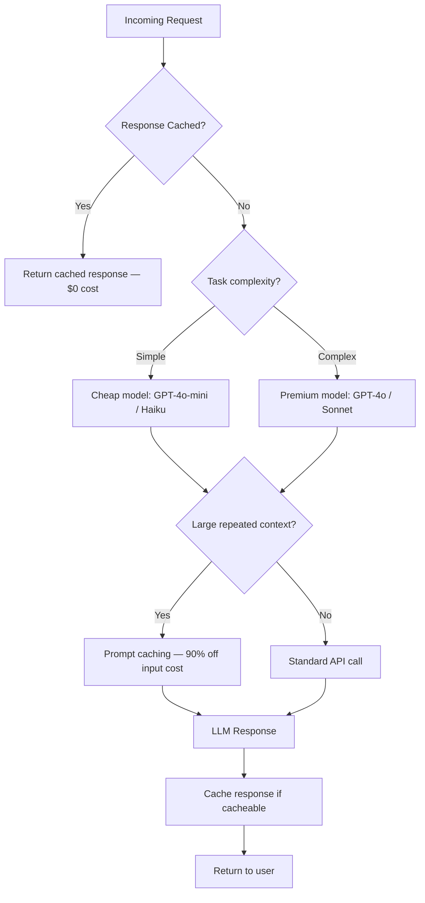

# LLM API Cost Optimization: Reduce Costs by 60%+

The first month of a production LLM application is always surprising. You estimated costs based on average token counts per request, multiplied by expected traffic, and arrived at a number that seemed manageable. Then the bill comes in at 3–5x your estimate.

The gap is almost always explained by the same set of issues: long system prompts sent on every request, large conversation histories that grow without bounds, using GPT-4o for tasks that GPT-4o-mini handles just as well, and no caching of repeated computation. None of these are exotic optimizations — they are engineering fundamentals applied to a new billing model.

I have seen teams cut their monthly LLM API spend from $8,000 to under $2,500 per month without any perceptible quality degradation to users, purely through systematic application of the techniques in this post. The key is instrumenting costs first so you know where to focus.

---

## Concept Overview

LLM API costs have two levers: **token count** and **price per token**. Every optimization technique targets one or both.

**Cost formula:**
```
Monthly cost = (input_tokens × input_price + output_tokens × output_price) × requests_per_month
```

**Pricing reference (early 2026, per 1M tokens):**

| Model | Input | Output | Cached Input |
|-------|-------|--------|-------------|
| GPT-4o | $2.50 | $10.00 | $1.25 |
| GPT-4o-mini | $0.15 | $0.60 | $0.075 |
| Claude 3.5 Sonnet | $3.00 | $15.00 | $0.30 |
| Claude 3 Haiku | $0.25 | $1.25 | $0.03 |
| Gemini 1.5 Pro | $1.25 | $5.00 | ~$0.31 |
| Gemini 1.5 Flash | $0.075 | $0.30 | ~$0.019 |

The delta between input and output pricing matters because output tokens are 4–5x more expensive per token than input tokens. Strategies that reduce output length have outsized cost impact.

**Cost optimization hierarchy (ROI order):**
1. Prompt caching (50–90% reduction on repeated context)
2. Model routing (10–20x cost reduction for simple tasks)
3. Response caching (eliminate 100% of repeat computation)
4. Prompt compression (15–40% token reduction)
5. Batch API (50% cost reduction with async processing)
6. Output length control (reduces expensive output tokens)

---

## How It Works



---

## Implementation Example

### Step 1: Instrument Costs First

You cannot optimize what you do not measure. Add cost tracking to every LLM call before doing anything else.

```python
from openai import OpenAI
from dataclasses import dataclass
from datetime import datetime
import json

# Cost per 1M tokens (update with current pricing)
PRICING = {
    "gpt-4o": {"input": 2.50, "output": 10.00, "cached_input": 1.25},
    "gpt-4o-mini": {"input": 0.15, "output": 0.60, "cached_input": 0.075},
    "claude-3-5-sonnet-20241022": {"input": 3.00, "output": 15.00, "cached_input": 0.30},
    "claude-3-haiku-20240307": {"input": 0.25, "output": 1.25, "cached_input": 0.03},
}

@dataclass
class APICallMetrics:
    model: str
    feature: str
    input_tokens: int
    output_tokens: int
    cached_tokens: int
    latency_ms: float
    cost_usd: float
    timestamp: str

def calculate_cost(model: str, usage) -> float:
    """Calculate cost in USD for an API call."""
    if model not in PRICING:
        return 0.0

    prices = PRICING[model]
    input_tokens = usage.prompt_tokens
    output_tokens = usage.completion_tokens
    cached_tokens = getattr(usage, 'prompt_tokens_details', None)
    cached_tokens = getattr(cached_tokens, 'cached_tokens', 0) if cached_tokens else 0

    non_cached_input = input_tokens - cached_tokens

    cost = (
        (non_cached_input / 1_000_000) * prices["input"] +
        (cached_tokens / 1_000_000) * prices.get("cached_input", prices["input"]) +
        (output_tokens / 1_000_000) * prices["output"]
    )
    return cost

client = OpenAI()
metrics_log: list[APICallMetrics] = []

def tracked_call(
    messages: list,
    model: str = "gpt-4o-mini",
    feature: str = "unknown",
    **kwargs
) -> str:
    """OpenAI call with cost tracking."""
    import time
    start = time.monotonic()

    response = client.chat.completions.create(
        model=model,
        messages=messages,
        **kwargs
    )

    latency_ms = (time.monotonic() - start) * 1000
    cost = calculate_cost(model, response.usage)

    metrics = APICallMetrics(
        model=model,
        feature=feature,
        input_tokens=response.usage.prompt_tokens,
        output_tokens=response.usage.completion_tokens,
        cached_tokens=0,
        latency_ms=latency_ms,
        cost_usd=cost,
        timestamp=datetime.utcnow().isoformat()
    )
    metrics_log.append(metrics)

    return response.choices[0].message.content

def cost_report():
    """Summarize costs by feature."""
    by_feature: dict[str, dict] = {}
    for m in metrics_log:
        if m.feature not in by_feature:
            by_feature[m.feature] = {"calls": 0, "cost": 0.0, "tokens": 0}
        by_feature[m.feature]["calls"] += 1
        by_feature[m.feature]["cost"] += m.cost_usd
        by_feature[m.feature]["tokens"] += m.input_tokens + m.output_tokens

    print("\n=== Cost Report ===")
    for feature, data in sorted(by_feature.items(), key=lambda x: -x[1]["cost"]):
        print(f"{feature:30} | ${data['cost']:.4f} | {data['calls']} calls | {data['tokens']:,} tokens")
    print(f"\nTotal: ${sum(m.cost_usd for m in metrics_log):.4f}")
```

### Step 2: Model Routing

Route requests to the cheapest model that meets the quality bar. GPT-4o-mini is 15–20x cheaper than GPT-4o for input tokens.

```python
def classify_task_complexity(user_input: str, context: dict = None) -> str:
    """
    Determine task complexity to select the appropriate model.
    Returns: 'simple', 'medium', or 'complex'
    """
    # Heuristics for task complexity
    word_count = len(user_input.split())

    simple_patterns = [
        "summarize", "classify", "extract", "translate",
        "format", "list", "yes or no", "true or false"
    ]
    complex_patterns = [
        "analyze", "debug", "architect", "design", "explain why",
        "write code", "review", "compare trade-offs", "evaluate"
    ]

    input_lower = user_input.lower()

    if any(p in input_lower for p in complex_patterns) or word_count > 200:
        return "complex"
    elif any(p in input_lower for p in simple_patterns) or word_count < 50:
        return "simple"
    else:
        return "medium"

def routed_call(
    messages: list,
    feature: str = "unknown",
    force_model: str = None
) -> str:
    """Route to cheapest appropriate model."""
    if force_model:
        model = force_model
    else:
        last_user_msg = next(
            (m["content"] for m in reversed(messages) if m["role"] == "user"),
            ""
        )
        complexity = classify_task_complexity(last_user_msg)
        model = {
            "simple": "gpt-4o-mini",
            "medium": "gpt-4o-mini",
            "complex": "gpt-4o"
        }[complexity]

    return tracked_call(messages, model=model, feature=feature, max_tokens=1024)

# Example: same interface, different models based on complexity
print(routed_call(
    [{"role": "user", "content": "Translate 'Hello world' to French."}],
    feature="translation"
))
# Uses gpt-4o-mini → $0.00003 per call

print(routed_call(
    [{"role": "user", "content": "Review this architecture and analyze trade-offs between microservices vs monolith for a team of 5 engineers..."}],
    feature="architecture_review"
))
# Uses gpt-4o → $0.0025 per call
```

### Step 3: Response Caching

For identical or near-identical requests, return cached responses. This is the highest ROI optimization for applications with repeated queries (FAQ bots, document Q&A on static content).

```python
import hashlib
import json
import time
from typing import Optional

class LLMCache:
    """
    Simple in-memory LLM response cache with TTL.
    For production, replace with Redis.
    """

    def __init__(self, ttl_seconds: int = 3600):
        self.cache: dict[str, tuple[str, float]] = {}
        self.ttl = ttl_seconds
        self.hits = 0
        self.misses = 0

    def _key(self, messages: list, model: str) -> str:
        """Generate deterministic cache key from messages + model."""
        content = json.dumps({"messages": messages, "model": model}, sort_keys=True)
        return hashlib.sha256(content.encode()).hexdigest()

    def get(self, messages: list, model: str) -> Optional[str]:
        key = self._key(messages, model)
        if key in self.cache:
            value, timestamp = self.cache[key]
            if time.time() - timestamp < self.ttl:
                self.hits += 1
                return value
            else:
                del self.cache[key]
        self.misses += 1
        return None

    def set(self, messages: list, model: str, response: str):
        key = self._key(messages, model)
        self.cache[key] = (response, time.time())

    def hit_rate(self) -> float:
        total = self.hits + self.misses
        return self.hits / total if total > 0 else 0.0

    def stats(self):
        print(f"Cache hits: {self.hits}, misses: {self.misses}, "
              f"hit rate: {self.hit_rate():.1%}")


cache = LLMCache(ttl_seconds=3600)

def cached_call(messages: list, model: str = "gpt-4o-mini", feature: str = "unknown") -> str:
    """LLM call with response caching."""
    # Check cache first
    cached = cache.get(messages, model)
    if cached:
        return cached

    # Cache miss — make the API call
    response = tracked_call(messages, model=model, feature=feature, max_tokens=1024)

    # Cache the response
    cache.set(messages, model, response)
    return response
```

### Step 4: Prompt Caching (Anthropic)

For applications with long, repeated system prompts or static documents, prompt caching is the single highest-ROI optimization.

```python
import anthropic

anthropic_client = anthropic.Anthropic()

# Example: document Q&A with prompt caching
LARGE_KNOWLEDGE_BASE = """
[Your 50,000-word knowledge base or specification document here]
""" * 50  # Simulating a large document

def cached_document_qa(question: str) -> str:
    """
    Query a large document with Anthropic prompt caching.

    First call: creates cache (slightly more expensive)
    Subsequent calls: 90% cheaper for the cached portion
    """
    response = anthropic_client.messages.create(
        model="claude-3-5-sonnet-20241022",
        max_tokens=1024,
        system=[
            {
                "type": "text",
                "text": "You are a helpful assistant answering questions about our product documentation.",
                "cache_control": {"type": "ephemeral"}
            }
        ],
        messages=[
            {
                "role": "user",
                "content": [
                    {
                        "type": "text",
                        "text": LARGE_KNOWLEDGE_BASE,
                        "cache_control": {"type": "ephemeral"}  # Cache this block
                    },
                    {
                        "type": "text",
                        "text": f"Question: {question}"
                    }
                ]
            }
        ]
    )

    usage = response.usage
    cache_read = getattr(usage, 'cache_read_input_tokens', 0)
    cache_create = getattr(usage, 'cache_creation_input_tokens', 0)

    if cache_read > 0:
        print(f"Cache hit: {cache_read:,} tokens at 90% discount")
    if cache_create > 0:
        print(f"Cache created: {cache_create:,} tokens")

    return response.content[0].text
```

### Step 5: Prompt Compression

Reduce input token count through systematic prompt compression.

```python
def compress_conversation_history(
    history: list[dict],
    max_tokens: int = 4000,
    keep_recent_turns: int = 6
) -> list[dict]:
    """
    Compress conversation history to stay within token budget.
    Strategy: keep system prompt + last N turns + summarize the rest.
    """
    import tiktoken
    encoding = tiktoken.encoding_for_model("gpt-4o-mini")

    def count_tokens(messages: list) -> int:
        return sum(len(encoding.encode(str(m.get("content", "")))) for m in messages)

    if count_tokens(history) <= max_tokens:
        return history  # No compression needed

    # Separate system message from conversation
    system_messages = [m for m in history if m["role"] == "system"]
    conversation = [m for m in history if m["role"] != "system"]

    # Always keep the last N conversation turns
    recent = conversation[-keep_recent_turns:] if len(conversation) > keep_recent_turns else conversation
    older = conversation[:-keep_recent_turns] if len(conversation) > keep_recent_turns else []

    if not older:
        return history

    # Summarize older turns
    older_text = "\n".join([
        f"{m['role'].upper()}: {m['content']}"
        for m in older
    ])

    summary_response = client.chat.completions.create(
        model="gpt-4o-mini",
        messages=[
            {
                "role": "user",
                "content": f"Summarize this conversation in 2-3 sentences, preserving key facts and decisions:\n\n{older_text}"
            }
        ],
        max_tokens=200,
        temperature=0
    )
    summary = summary_response.choices[0].message.content

    # Reconstruct compressed history
    compressed = system_messages + [
        {"role": "assistant", "content": f"[Summary of earlier conversation: {summary}]"}
    ] + recent

    return compressed

def compress_system_prompt(system_prompt: str) -> str:
    """Remove redundant whitespace and boilerplate from system prompts."""
    import re
    # Remove extra whitespace and newlines
    compressed = re.sub(r'\n{3,}', '\n\n', system_prompt.strip())
    compressed = re.sub(r'[ \t]+', ' ', compressed)
    return compressed
```

### Step 6: OpenAI Batch API

For non-real-time workloads, the Batch API processes requests at 50% lower cost.

```python
import json
from openai import OpenAI
import time

client = OpenAI()

def process_batch(items: list[dict], system_prompt: str) -> list[str]:
    """
    Process a batch of items using the OpenAI Batch API.
    50% cheaper than real-time API. Results available within 24 hours.
    """
    # Create batch requests file
    requests = []
    for i, item in enumerate(items):
        request = {
            "custom_id": f"request-{i}",
            "method": "POST",
            "url": "/v1/chat/completions",
            "body": {
                "model": "gpt-4o-mini",
                "messages": [
                    {"role": "system", "content": system_prompt},
                    {"role": "user", "content": item["content"]}
                ],
                "max_tokens": item.get("max_tokens", 500),
                "temperature": 0
            }
        }
        requests.append(json.dumps(request))

    # Write to JSONL file
    batch_file_content = "\n".join(requests)

    # Upload batch file
    batch_file = client.files.create(
        file=("batch_requests.jsonl", batch_file_content.encode(), "application/json"),
        purpose="batch"
    )

    # Create batch job
    batch = client.batches.create(
        input_file_id=batch_file.id,
        endpoint="/v1/chat/completions",
        completion_window="24h"
    )

    print(f"Batch created: {batch.id}. Poll for completion...")
    return batch.id

def retrieve_batch_results(batch_id: str) -> list[dict]:
    """Retrieve and parse completed batch results."""
    batch = client.batches.retrieve(batch_id)

    if batch.status != "completed":
        print(f"Batch status: {batch.status}")
        return []

    # Download results
    result_file = client.files.content(batch.output_file_id)
    results = []
    for line in result_file.text.strip().split("\n"):
        result = json.loads(line)
        custom_id = result["custom_id"]
        content = result["response"]["body"]["choices"][0]["message"]["content"]
        results.append({"id": custom_id, "content": content})

    return results
```

---

## Real Cost Math

Here is a realistic before/after analysis for a document Q&A application processing 10,000 queries per day against a 50K-token knowledge base:

**Before optimization:**
- Model: GPT-4o (default)
- System prompt: 50K tokens sent every request (no caching)
- History: 8K average tokens
- Total input: ~58K tokens per request
- Output: ~500 tokens average
- Cost: (58K × $2.50 + 500 × $10.00) / 1M × 10,000 = $1,950/day = ~$58,500/month

**After optimization:**
- Model: GPT-4o-mini for 70% of queries, GPT-4o for 30%
- Prompt caching: 50K context tokens cached at 90% discount
- Response caching: 25% of queries return cached results
- Compressed history: 3K average tokens (was 8K)
- Effective daily cost: ~$180/day = ~$5,400/month

**Total reduction: ~90% cost savings**

---

## Best Practices

**Measure before optimizing.** Add per-feature cost tracking before anything else. The highest-cost features are almost never the ones you expect.

**Cache at the right TTL.** Response caching works well for FAQ-style queries where the same question gets asked repeatedly. Use TTLs of 1–24 hours for most content. For time-sensitive content (stock prices, news), do not cache or use very short TTLs.

**Test quality after every optimization.** Switching from GPT-4o to GPT-4o-mini for complex tasks can degrade quality in ways that are not obvious from token counts. Maintain a test set of representative queries and evaluate output quality before and after model changes.

**Compress prompts without losing meaning.** Prompt compression that removes critical instructions or context hurts quality more than it saves on cost. Focus compression on repetitive boilerplate, extra whitespace, and verbose examples that could be more concise.

---

## Common Mistakes

1. **Optimizing output length at the expense of completeness.** Setting `max_tokens` too low truncates responses mid-sentence. Users notice. Find the natural output length for your use case before enforcing strict limits.

2. **Caching responses with personal or sensitive data.** If your prompts include user-specific data, cached responses may contain one user's data and be returned to another. Only cache responses to queries that are genuinely identical and impersonal.

3. **Not accounting for cache miss costs.** Prompt caching on Anthropic has a "cache write" cost that is 25% more than normal input cost. If your cache hit rate is below 50%, caching may not save money. Track hit rates.

4. **Routing complex tasks to cheap models to save cost.** If GPT-4o-mini produces noticeably worse output for a specific task, the quality cost (user frustration, support tickets) may exceed the API cost savings. Quality must be the constraint, not cost.

5. **Ignoring output token costs.** Input tokens are 4–5x cheaper than output tokens in most models. Prompts that instruct the model to "explain in detail" or "provide a comprehensive response" generate expensive output. Be explicit about desired response length.

---

## Summary

LLM API cost optimization follows a clear hierarchy: instrument costs first, then apply prompt caching for repeated context, model routing for task-appropriate models, response caching for repeated queries, prompt compression for bloated prompts, and the Batch API for non-real-time workloads. Applying these techniques systematically can reduce costs by 60–90% while maintaining quality for the vast majority of use cases.

---

## Related Articles

- [LLM APIs Guide for Developers](/blog/llm-api-guide/)
- [Rate Limiting Strategies for LLM APIs](/blog/llm-rate-limits/)
- [LLM API Error Handling Best Practices](/blog/llm-api-errors/)
- [Prompt Engineering Guide](/blog/prompt-engineering-guide/)

---

## FAQ

**Q: How much does prompt caching actually save in practice?**

For applications where 80%+ of input tokens come from a repeated system prompt or static document, caching reduces input token costs by up to 90%. Real-world savings depend on your cache hit rate. A document Q&A app querying the same knowledge base sees dramatic savings; a creative writing tool with unique prompts per request sees little benefit.

**Q: Should I always use the cheapest model?**

No — use the cheapest model that meets your quality bar. Run both models on your representative test set and measure quality. For most classification, summarization, and extraction tasks, GPT-4o-mini and Claude 3 Haiku perform comparably to their expensive counterparts at 10–20x lower cost.

**Q: When should I use the OpenAI Batch API?**

For any workload that does not need real-time results. Data enrichment, bulk content generation, offline document processing, nightly report generation — all good Batch API candidates. The 24-hour completion window is the constraint; if you need results within seconds, use the regular API.

**Q: How do I handle prompt caching with dynamic content?**

Structure your prompts so the static portions (knowledge base, instructions, examples) come first in the messages, and the dynamic portions (user query, user-specific context) come last. Caching works on the prefix up to the `cache_control` marker — the static prefix gets cached, and only the dynamic suffix is billed at full price.

---

<script type="application/ld+json">
{
  "@context": "https://schema.org",
  "@type": "FAQPage",
  "mainEntity": [
    {
      "@type": "Question",
      "name": "How much does prompt caching actually save in practice?",
      "acceptedAnswer": {
        "@type": "Answer",
        "text": "For applications where 80%+ of input tokens come from a repeated system prompt or static document, caching reduces input token costs by up to 90%. Real-world savings depend on your cache hit rate."
      }
    },
    {
      "@type": "Question",
      "name": "Should I always use the cheapest model?",
      "acceptedAnswer": {
        "@type": "Answer",
        "text": "No — use the cheapest model that meets your quality bar. Run both models on your test set and measure quality. For most classification, summarization, and extraction tasks, GPT-4o-mini performs comparably to GPT-4o at 10-20x lower cost."
      }
    },
    {
      "@type": "Question",
      "name": "When should I use the OpenAI Batch API?",
      "acceptedAnswer": {
        "@type": "Answer",
        "text": "For any workload that does not need real-time results — data enrichment, bulk content generation, offline document processing, nightly reports. The 24-hour completion window is the constraint."
      }
    },
    {
      "@type": "Question",
      "name": "How do I handle prompt caching with dynamic content?",
      "acceptedAnswer": {
        "@type": "Answer",
        "text": "Structure prompts so the static portions (knowledge base, instructions) come first and dynamic portions (user query) come last. The static prefix gets cached; only the dynamic suffix is billed at full price."
      }
    }
  ]
}
</script>
