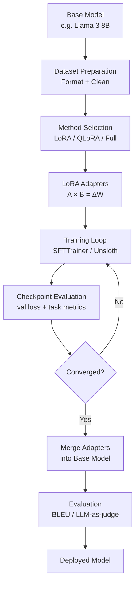

# LLM Fine-Tuning Guide: LoRA, QLoRA, and Full Fine-Tuning

Most teams reach for fine-tuning too early. The pattern I see repeatedly: an engineer gets a general-purpose LLM, struggles to get consistent outputs through prompting, and concludes the model needs to be fine-tuned. Three weeks later they have a fine-tuned model that performs worse than the original — because the data quality was poor, the evaluation was informal, or the task was actually solvable with a better system prompt.

Fine-tuning is powerful. It is also the most expensive, slowest-to-iterate option in the LLM adaptation toolkit. This guide exists to help you make the right call about when to fine-tune, and when to stop short of it. When you do need to fine-tune, it covers the full pipeline — dataset preparation, method selection, training configuration, evaluation, and deployment — with real code that you can run.

The techniques covered here — LoRA, QLoRA, and full fine-tuning — reflect what production teams actually use in 2026. Unsloth, TRL, and PEFT are the dominant open-source toolchain, and that is what the code examples use.

## Concept Overview

Fine-tuning is the process of continuing training on a pre-trained base model using a smaller, curated dataset. The model's weights — already shaped by training on hundreds of billions of tokens — shift to improve performance on your specific task.

Three strategies exist, with very different resource requirements:

**Full fine-tuning** updates every parameter in the model. A 7B model has 7 billion parameters, each stored as a float16 value. Full fine-tuning requires holding the model weights, gradients, and optimizer states simultaneously — roughly 14x the model size in VRAM. For a 7B model, that's ~98GB, requiring at least 2×A100 80GB GPUs.

**LoRA (Low-Rank Adaptation)** freezes the base model and adds small trainable adapter matrices to the attention layers. Only the adapter parameters — typically 0.1–1% of total parameters — are updated. A 7B model with LoRA fits in ~16GB VRAM.

**QLoRA (Quantized LoRA)** takes LoRA a step further by quantizing the frozen base model to 4-bit precision (NF4 format). The adapters train in 16-bit. A 7B model with QLoRA fits in ~10GB VRAM — accessible on a single RTX 3090 or even a free Colab T4.

### When to Fine-Tune vs. Prompting vs. RAG

This decision matters more than any training hyperparameter:

| Approach | Use when | Time to deploy | Cost |
|----------|----------|---------------|------|
| Prompting | Task is achievable with clear instructions | Hours | Low |
| RAG | Domain knowledge is the gap, not behavior | Days | Medium |
| Fine-tuning | Consistent style/format, behavior not knowledge | Weeks | High |
| Full fine-tuning | Major domain shift or new capabilities | Months | Very high |

Fine-tuning wins when you need a specific output format to be consistent across thousands of calls, when the task requires a writing style or tone that cannot be injected reliably via system prompt, or when you need to deploy a smaller, faster, cheaper model than the frontier option.

Fine-tuning does not help when the model's knowledge is the gap. If your model hallucinates because it lacks domain facts, fine-tuning on examples will teach it to generate confidently — not accurately. Use RAG for knowledge gaps.

## How It Works



In practice, the dataset preparation and evaluation stages consume more engineering time than the training itself. A training run on a 7B model with LoRA takes 30–90 minutes for 1,000 examples. Preparing those 1,000 high-quality examples takes days.

## Implementation Example

### Install Dependencies

```bash
pip install unsloth trl peft transformers datasets accelerate bitsandbytes
```

### Full QLoRA Training Script

```python
from unsloth import FastLanguageModel
from trl import SFTTrainer, SFTConfig
from datasets import load_dataset
import torch

# --- 1. Load Base Model with Unsloth (2-5x faster than standard PEFT) ---
model, tokenizer = FastLanguageModel.from_pretrained(
    model_name="unsloth/Meta-Llama-3-8B-Instruct",
    max_seq_length=2048,
    dtype=None,           # Auto-detect: bfloat16 on Ampere+, float16 otherwise
    load_in_4bit=True,    # QLoRA: 4-bit quantization
)

# --- 2. Add LoRA Adapters ---
model = FastLanguageModel.get_peft_model(
    model,
    r=16,                 # LoRA rank — start at 16, increase if underfitting
    target_modules=[
        "q_proj", "k_proj", "v_proj", "o_proj",
        "gate_proj", "up_proj", "down_proj",
    ],
    lora_alpha=16,        # Keep alpha == r for stable training
    lora_dropout=0.0,     # Unsloth recommends 0 for optimized kernels
    bias="none",
    use_gradient_checkpointing="unsloth",  # Saves 30% VRAM
    random_state=42,
)

model.print_trainable_parameters()
# trainable params: 41,943,040 || all params: 8,072,884,224 || trainable%: 0.52%

# --- 3. Prepare Dataset ---
dataset = load_dataset("json", data_files="train.jsonl", split="train")

def format_chat(example):
    """Apply the model's chat template."""
    messages = [
        {"role": "system", "content": example.get("system", "You are a helpful assistant.")},
        {"role": "user",   "content": example["instruction"]},
        {"role": "assistant", "content": example["output"]},
    ]
    return {
        "text": tokenizer.apply_chat_template(
            messages, tokenize=False, add_generation_prompt=False
        )
    }

dataset = dataset.map(format_chat)
train_ds = dataset.select(range(int(len(dataset) * 0.9)))
eval_ds  = dataset.select(range(int(len(dataset) * 0.9), len(dataset)))

print(f"Train: {len(train_ds)}, Eval: {len(eval_ds)}")
print(train_ds[0]["text"][:400])  # Always verify format before training

# --- 4. Configure Training ---
training_config = SFTConfig(
    output_dir="./llama3-finetuned",
    num_train_epochs=3,
    per_device_train_batch_size=2,
    per_device_eval_batch_size=2,
    gradient_accumulation_steps=8,   # Effective batch = 16
    warmup_steps=50,
    learning_rate=2e-4,
    fp16=not torch.cuda.is_bf16_supported(),
    bf16=torch.cuda.is_bf16_supported(),
    logging_steps=25,
    eval_strategy="steps",
    eval_steps=100,
    save_strategy="steps",
    save_steps=200,
    optim="adamw_8bit",              # 8-bit optimizer reduces memory
    weight_decay=0.01,
    lr_scheduler_type="cosine",
    max_seq_length=2048,
    dataset_text_field="text",
    report_to="none",
)

# --- 5. Train ---
trainer = SFTTrainer(
    model=model,
    tokenizer=tokenizer,
    train_dataset=train_ds,
    eval_dataset=eval_ds,
    args=training_config,
)

print("Starting training...")
trainer_stats = trainer.train()
print(f"Training complete. Loss: {trainer_stats.training_loss:.4f}")

# --- 6. Save Adapter ---
trainer.model.save_pretrained("./adapter")
tokenizer.save_pretrained("./adapter")
print("Adapter saved (50-200MB). Use merge step for production deployment.")
```

### Merge Adapter for Production

```python
from unsloth import FastLanguageModel

# Load base model + adapter and merge
model, tokenizer = FastLanguageModel.from_pretrained(
    model_name="./adapter",  # Points to adapter directory
    max_seq_length=2048,
    dtype=torch.bfloat16,
    load_in_4bit=False,       # Load in full precision for merge
)

# Merge LoRA weights into base model
model.save_pretrained_merged(
    "./merged-model",
    tokenizer,
    save_method="merged_16bit",  # Full precision merged model
)
print("Merged model saved. Ready for vLLM or Ollama deployment.")
```

### Full Fine-Tuning (When You Have the Budget)

Full fine-tuning is appropriate when LoRA quality falls short after extensive tuning, or when making large-scale domain shifts. It requires significantly more VRAM:

```python
from transformers import AutoModelForCausalLM, AutoTokenizer, TrainingArguments
from trl import SFTTrainer, SFTConfig

# Load in bfloat16 — no quantization for full fine-tuning
model = AutoModelForCausalLM.from_pretrained(
    "meta-llama/Meta-Llama-3-8B-Instruct",
    torch_dtype=torch.bfloat16,
    device_map="auto",
    attn_implementation="flash_attention_2",  # Required for long contexts
)

training_config = SFTConfig(
    output_dir="./full-finetuned",
    num_train_epochs=1,               # Usually 1-2 epochs for full FT
    per_device_train_batch_size=1,
    gradient_accumulation_steps=16,
    learning_rate=5e-6,               # Much lower LR for full fine-tuning
    bf16=True,
    gradient_checkpointing=True,      # Trades compute for VRAM
    optim="adamw_bnb_8bit",
    max_seq_length=2048,
    dataset_text_field="text",
)

# Full fine-tuning — no PEFT config needed
trainer = SFTTrainer(
    model=model,
    tokenizer=tokenizer,
    train_dataset=train_ds,
    eval_dataset=eval_ds,
    args=training_config,
)
trainer.train()
```

## Best Practices

**Start with QLoRA on a 7B model, not a 70B model.** The quality gap between 7B and 70B fine-tuned models is often smaller than expected, and the iteration speed difference is enormous. Validate your dataset and training config on 7B before scaling up.

**Use the model's official chat template.** Every instruction-tuned model has a specific template format (Llama 3 uses `<|begin_of_text|>`, `<|start_header_id|>`, etc.). Applying the wrong template or a custom one degrades quality significantly. Always use `tokenizer.apply_chat_template()`.

**Separate training and evaluation data before writing a single line of training code.** Hold out 10–15% of examples. If you only discover you need an eval set after training, the data has already been contaminated.

**Monitor validation loss, not just training loss.** Training loss always decreases — that is what gradient descent does. Validation loss tells you whether the model is generalizing. If validation loss starts rising while training loss falls, you are overfitting.

**Run a sample generation every N steps.** Quantitative metrics lag qualitative issues. Generating a few test examples during training reveals format collapse, repetition, and other problems that loss curves miss.

**Use `lora_alpha = r` as the starting default.** The effective learning rate for LoRA updates scales as `lora_alpha / r`. Keeping them equal normalizes this scaling. Increase `r` (and `lora_alpha` proportionally) if the model is underfitting.

## Common Mistakes

1. **Fine-tuning when prompting would solve the problem.** Before starting a fine-tuning project, write 20 diverse test prompts and iterate on the system prompt for two hours. If you can hit 80% success rate with prompting, fine-tuning adds complexity without clear benefit.

2. **Training on fewer than 200 examples.** With very small datasets, the model memorizes examples rather than learning generalizable patterns. The validation loss will look good but real-world performance degrades. Aim for 500–2,000 examples for most tasks.

3. **Using inconsistent prompt formats across training examples.** If 60% of your examples use one format and 40% use another, the model learns a confused mixture. Every training example must use the exact same template.

4. **Not setting `pad_token` before training.** Most causal language models have no pad token by default. Setting `tokenizer.pad_token = tokenizer.eos_token` is required for batched training to work correctly. Forgetting this causes silent errors.

5. **Choosing too high a learning rate.** LoRA typically uses `2e-4` as a starting point, but lower rates (`1e-4`, `5e-5`) often produce more stable training on small datasets. Full fine-tuning uses much lower rates (`1e-5` to `5e-6`). The loss spike pattern at the start of training often signals an LR that is too high.

6. **Skipping the merge step and serving the adapter directly in production.** Serving an adapter on top of a quantized base model is slower than serving a merged model. Merge before production deployment unless adapter hot-swapping is architecturally required.

7. **Evaluating only with perplexity.** Perplexity measures how well the model predicts the next token in your eval set — but a model can have low perplexity while failing badly at the actual task. Always pair perplexity with task-specific evaluation (format adherence, accuracy on labeled examples, or LLM-as-judge scoring).

## Summary

Fine-tuning adapts a pre-trained LLM to a specific task by continuing training on a curated dataset. Three methods cover the practical range: full fine-tuning for maximum control at high compute cost, LoRA for efficient adapter-based tuning, and QLoRA for memory-constrained hardware using 4-bit quantization.

The decision framework is simple: start with prompting, add RAG if knowledge is the gap, and reach for fine-tuning only when behavior consistency or latency/cost requirements demand it. When you fine-tune, use QLoRA with Unsloth for most cases — it is fast, memory-efficient, and produces high-quality adapters.

Dataset quality is the dominant factor in fine-tuning success. Investing time in curating 500 excellent examples outperforms using 5,000 mediocre ones.

## Related Articles

- [LoRA Fine-Tuning Tutorial for LLMs](/blog/lora-fine-tuning-tutorial/) — Step-by-step LoRA implementation with Unsloth and TRL
- [QLoRA Explained: Efficient Fine-Tuning on Consumer Hardware](/blog/qlora-explained/) — Deep dive into 4-bit quantization and paged optimizers
- [Training LLMs with HuggingFace](/blog/huggingface-training/) — HuggingFace ecosystem: Trainer, TRL, Accelerate, PEFT
- [Dataset Preparation for LLM Fine-Tuning](/blog/finetuning-datasets/) — Data formats, quality filtering, and synthetic data generation
- [Instruction Tuning Explained](/blog/instruction-tuning/) — How LLMs learn to follow instructions with SFT
- [RLHF Explained](/blog/rlhf-guide/) — From SFT to reward models to PPO-aligned models
- [LLM Evaluation Metrics](/blog/llm-evaluation/) — How to measure quality of fine-tuned models
- [How LLMs Work](/blog/how-llms-work/) — Transformer architecture and pre-training fundamentals

## FAQ

**How much data do I need to fine-tune an LLM?**
For task adaptation (teaching a specific output format or style), 500–2,000 high-quality examples is a good starting range. For domain adaptation with new vocabulary and concepts, 5,000–50,000 examples is more appropriate. Quality matters far more than quantity — 500 excellent examples outperform 5,000 mediocre ones consistently.

**What is the difference between LoRA rank and LoRA alpha?**
Rank (`r`) controls the size of the adapter matrices — higher rank means more trainable parameters and more capacity to learn. Alpha (`lora_alpha`) is a scaling factor that controls the magnitude of the LoRA updates. The effective contribution of LoRA is scaled by `alpha / r`. Keeping `alpha == r` normalizes this to 1.0, making the LoRA contribution equivalent to full weight updates at the given learning rate.

**Can I fine-tune on a single GPU?**
Yes. With QLoRA, a 7B model trains on a single 16GB GPU (RTX 3090, RTX 4090, or free Colab T4). A 13B model needs ~24GB (A100 or RTX 3090 with QLoRA). A 70B model with QLoRA needs ~48GB, requiring an A100 80GB. Unsloth further reduces memory requirements by 30–50% compared to standard PEFT.

**Does fine-tuning make models forget their general capabilities?**
Yes — this is called catastrophic forgetting and is a real risk, especially with full fine-tuning on small datasets. LoRA is more resistant to forgetting because the base model weights remain frozen. To mitigate it: use a diverse training set, keep epochs low (1–3), and always test the fine-tuned model on general benchmarks alongside your task-specific eval.

**When should I use Unsloth vs. standard HuggingFace PEFT?**
Use Unsloth when training on a single GPU — it provides 2–5x speed improvement and significant memory savings through optimized CUDA kernels. Use standard PEFT/Accelerate when training across multiple GPUs, as Unsloth does not currently support multi-GPU distributed training.

<script type="application/ld+json">
{
  "@context": "https://schema.org",
  "@type": "FAQPage",
  "mainEntity": [
    {
      "@type": "Question",
      "name": "How much data do I need to fine-tune an LLM?",
      "acceptedAnswer": {
        "@type": "Answer",
        "text": "For task adaptation, 500–2,000 high-quality examples is a good starting range. For domain adaptation with new vocabulary, 5,000–50,000 examples is more appropriate. Quality matters far more than quantity."
      }
    },
    {
      "@type": "Question",
      "name": "What is the difference between LoRA rank and LoRA alpha?",
      "acceptedAnswer": {
        "@type": "Answer",
        "text": "Rank (r) controls adapter matrix size — higher rank means more trainable parameters. Alpha (lora_alpha) is a scaling factor controlling the magnitude of LoRA updates. Keeping alpha == r normalizes the contribution to 1.0."
      }
    },
    {
      "@type": "Question",
      "name": "Can I fine-tune on a single GPU?",
      "acceptedAnswer": {
        "@type": "Answer",
        "text": "Yes. With QLoRA, a 7B model trains on a single 16GB GPU. A 13B model needs ~24GB. A 70B model with QLoRA needs ~48GB. Unsloth reduces memory requirements by 30–50% compared to standard PEFT."
      }
    },
    {
      "@type": "Question",
      "name": "Does fine-tuning make models forget their general capabilities?",
      "acceptedAnswer": {
        "@type": "Answer",
        "text": "Yes — catastrophic forgetting is a real risk, especially with full fine-tuning on small datasets. LoRA is more resistant because base weights remain frozen. Mitigate it with diverse training data, low epoch counts, and general benchmark testing."
      }
    },
    {
      "@type": "Question",
      "name": "When should I use Unsloth vs. standard HuggingFace PEFT?",
      "acceptedAnswer": {
        "@type": "Answer",
        "text": "Use Unsloth for single-GPU training — it is 2–5x faster with lower memory. Use standard PEFT/Accelerate for multi-GPU distributed training, as Unsloth does not support distributed training."
      }
    }
  ]
}
</script>
