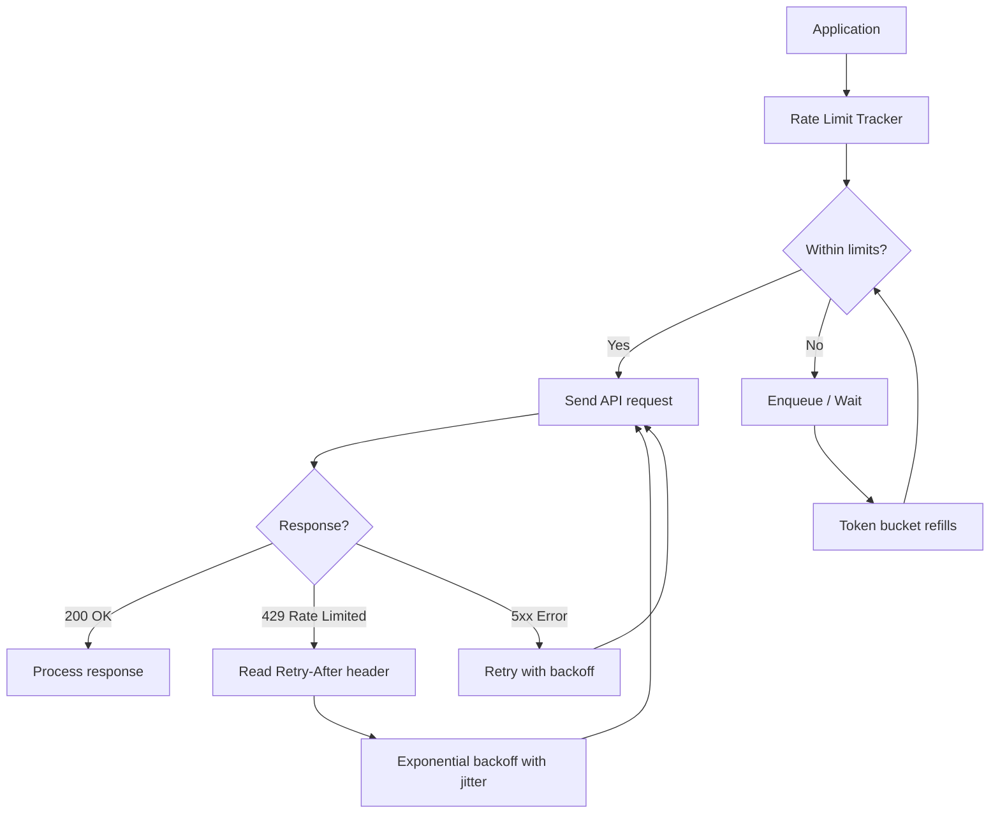

# Rate Limiting Strategies for LLM APIs

Rate limit errors are one of the most common production issues in LLM-powered applications. Not because they are hard to handle, but because most developers handle them in development (where traffic is low) and are surprised when the same code fails at scale.

The 429 error from OpenAI or Anthropic does not mean your API key is broken. It means you have exceeded the number of tokens or requests the provider allows for your account tier per minute. This happens for several reasons that are not immediately obvious: a single GPT-4o call with a long system prompt can consume thousands of tokens, and if you have dozens of concurrent users, you can hit TPM limits even with modest per-user traffic.

Understanding exactly what limits apply to your account tier, implementing proper backoff, and building a queuing layer for high-throughput applications are the three things that separate a fragile LLM integration from a production-ready one.

---

## Concept Overview

**Rate limits** on LLM APIs come in two dimensions:

- **RPM (Requests Per Minute)** — How many API calls you can make in a rolling 60-second window
- **TPM (Tokens Per Minute)** — How many total tokens (input + output) you can process in a rolling 60-second window

Most production failures are TPM failures, not RPM failures. A single large-context request — say, 50K tokens of documents plus a 2K response — counts as 52K tokens against your TPM limit. At tier 1, OpenAI's GPT-4o limit is around 30K TPM. That single request would consume nearly 2x your minute budget.

**OpenAI tier limits (approximate, 2026):**

| Tier | GPT-4o TPM | GPT-4o RPM | GPT-4o-mini TPM |
|------|------------|------------|-----------------|
| Free | 30K | 500 | 200K |
| Tier 1 ($5 spent) | 800K | 500 | 2M |
| Tier 2 ($50 spent) | 2M | 5K | 10M |
| Tier 3 ($100 spent) | 5M | 5K | 20M |
| Tier 4 ($250 spent) | 10M | 10K | 50M |

*Check platform.openai.com/settings/organization/limits for your current limits.*

Anthropic and Google have similar tiered structures. The key insight: you may need to spend a certain amount with the provider before your limits increase. This matters for launch planning.

---

## How It Works



When you receive a 429, the response headers contain useful information: `retry-after` (seconds to wait), `x-ratelimit-remaining-requests`, `x-ratelimit-remaining-tokens`, and `x-ratelimit-reset-requests` (timestamp when limits reset). Using these headers for proactive throttling is more efficient than reacting to 429 errors after they occur.

---

## Implementation Example

### Basic Exponential Backoff with Jitter

```python
import time
import random
from openai import OpenAI, RateLimitError, APIStatusError

client = OpenAI()

def call_with_backoff(
    messages: list,
    model: str = "gpt-4o-mini",
    max_retries: int = 6,
    base_delay: float = 1.0,
    max_delay: float = 60.0
) -> str:
    """
    LLM API call with exponential backoff and jitter.
    Jitter prevents thundering herd when multiple clients retry simultaneously.
    """
    for attempt in range(max_retries):
        try:
            response = client.chat.completions.create(
                model=model,
                messages=messages,
                max_tokens=1024,
                timeout=30
            )
            return response.choices[0].message.content

        except RateLimitError as e:
            if attempt == max_retries - 1:
                raise  # Give up after max retries

            # Exponential backoff: 1s, 2s, 4s, 8s, 16s, 32s
            delay = min(base_delay * (2 ** attempt), max_delay)

            # Add jitter: ±25% of delay to desynchronize retries
            jitter = delay * 0.25 * (random.random() * 2 - 1)
            sleep_time = delay + jitter

            print(f"Rate limited (attempt {attempt + 1}/{max_retries}). "
                  f"Waiting {sleep_time:.1f}s...")
            time.sleep(sleep_time)

        except APIStatusError as e:
            if e.status_code >= 500:
                # Server error — retry with backoff
                if attempt < max_retries - 1:
                    time.sleep(base_delay * (2 ** attempt))
                else:
                    raise
            else:
                raise  # 4xx errors (except 429) are not retryable

    raise RuntimeError("Max retries exceeded")


# Usage
result = call_with_backoff([
    {"role": "user", "content": "Summarize the benefits of rate limiting."}
])
print(result)
```

Jitter is critical for high-concurrency systems. Without it, all clients that were rate-limited at the same moment will retry simultaneously, creating another burst that triggers more rate limits — a thundering herd. Adding randomness to the backoff delay spreads retries over time.

### Reading Rate Limit Headers

```python
import httpx

def call_with_header_awareness(
    messages: list,
    model: str = "gpt-4o-mini"
) -> tuple[str, dict]:
    """Call OpenAI API and return response + rate limit metadata from headers."""

    # Use raw HTTP to access response headers
    # (The OpenAI SDK wraps this, but we can access via _response attribute)
    response = client.chat.completions.create(
        model=model,
        messages=messages,
        max_tokens=512
    )

    # Access rate limit info from raw response headers
    raw_response = response._request_id  # SDK internal

    result = response.choices[0].message.content
    return result

def monitor_rate_limits():
    """Monitor current rate limit status from OpenAI headers."""
    import openai

    # Use httpx directly to access headers
    headers_info = {}

    with openai.APIClient(api_key="your-key") as api_client:
        response = api_client.post(
            "/chat/completions",
            json={
                "model": "gpt-4o-mini",
                "messages": [{"role": "user", "content": "Hi"}],
                "max_tokens": 5
            }
        )
        # Capture rate limit headers
        headers_info = {
            "remaining_requests": response.headers.get("x-ratelimit-remaining-requests"),
            "remaining_tokens": response.headers.get("x-ratelimit-remaining-tokens"),
            "reset_requests": response.headers.get("x-ratelimit-reset-requests"),
            "reset_tokens": response.headers.get("x-ratelimit-reset-tokens"),
        }

    return headers_info
```

### Token Bucket Rate Limiter

A token bucket controls outgoing request rate on the client side — preventing you from hitting provider limits in the first place.

```python
import threading
import time
from dataclasses import dataclass, field
from typing import Optional

@dataclass
class TokenBucket:
    """
    Token bucket rate limiter for TPM control.
    Tokens refill at a constant rate up to the bucket capacity.
    """
    capacity: int       # Maximum tokens (= TPM limit)
    refill_rate: float  # Tokens added per second (= TPM / 60)
    tokens: float = field(init=False)
    last_refill: float = field(init=False)
    lock: threading.Lock = field(default_factory=threading.Lock, init=False)

    def __post_init__(self):
        self.tokens = self.capacity
        self.last_refill = time.monotonic()

    def _refill(self):
        """Refill tokens based on time elapsed since last refill."""
        now = time.monotonic()
        elapsed = now - self.last_refill
        added = elapsed * self.refill_rate
        self.tokens = min(self.capacity, self.tokens + added)
        self.last_refill = now

    def consume(self, tokens: int, timeout: float = 60.0) -> bool:
        """
        Consume tokens from the bucket.
        Blocks until tokens are available or timeout is reached.
        Returns True if consumed, False if timed out.
        """
        deadline = time.monotonic() + timeout

        while time.monotonic() < deadline:
            with self.lock:
                self._refill()
                if self.tokens >= tokens:
                    self.tokens -= tokens
                    return True

            # Not enough tokens — wait for refill
            wait_time = (tokens - self.tokens) / self.refill_rate
            wait_time = min(wait_time, 0.5)  # Check at most every 500ms
            time.sleep(wait_time)

        return False  # Timed out


# Create a bucket for GPT-4o-mini at Tier 1 (2M TPM)
# 2,000,000 tokens per minute = ~33,333 tokens per second
tpm_bucket = TokenBucket(
    capacity=100_000,      # Burst capacity (allow short bursts)
    refill_rate=33_333     # Steady-state refill rate
)

def rate_limited_call(messages: list, estimated_tokens: int = 1000) -> Optional[str]:
    """API call with client-side token bucket rate limiting."""
    if not tpm_bucket.consume(estimated_tokens, timeout=30):
        raise RuntimeError("Rate limit queue timed out — system overloaded")

    response = client.chat.completions.create(
        model="gpt-4o-mini",
        messages=messages,
        max_tokens=estimated_tokens // 2  # Rough split: half input, half output
    )
    return response.choices[0].message.content
```

### Queue-Based Rate Limiting for High Throughput

For batch processing applications or services handling many concurrent users, a queue with worker pool provides better control.

```python
import asyncio
from asyncio import Queue
from openai import AsyncOpenAI
from dataclasses import dataclass
from typing import Callable, Any

@dataclass
class LLMRequest:
    messages: list
    model: str
    max_tokens: int
    callback: Callable
    priority: int = 0

class RateLimitedLLMQueue:
    """
    Async queue with rate limiting for high-throughput LLM calls.
    Controls both RPM and TPM simultaneously.
    """

    def __init__(
        self,
        max_rpm: int = 500,
        max_tpm: int = 2_000_000,
        max_workers: int = 10
    ):
        self.max_rpm = max_rpm
        self.max_tpm = max_tpm
        self.max_workers = max_workers
        self.queue: Queue[LLMRequest] = Queue()
        self.client = AsyncOpenAI()

        # Rate tracking
        self.request_timestamps: list[float] = []
        self.token_timestamps: list[tuple[float, int]] = []

    async def _check_rpm(self) -> float:
        """Return delay needed to stay within RPM limit."""
        now = time.monotonic()
        # Remove timestamps older than 60 seconds
        self.request_timestamps = [
            ts for ts in self.request_timestamps
            if now - ts < 60
        ]

        if len(self.request_timestamps) >= self.max_rpm:
            # Wait until oldest request falls outside the 60s window
            oldest = self.request_timestamps[0]
            return 60 - (now - oldest) + 0.1

        return 0

    async def submit(self, request: LLMRequest):
        """Add a request to the queue."""
        await self.queue.put(request)

    async def worker(self):
        """Worker that processes requests from the queue with rate limiting."""
        while True:
            request = await self.queue.get()

            # Check rate limits
            rpm_delay = await self._check_rpm()
            if rpm_delay > 0:
                await asyncio.sleep(rpm_delay)

            try:
                response = await self.client.chat.completions.create(
                    model=request.model,
                    messages=request.messages,
                    max_tokens=request.max_tokens
                )

                self.request_timestamps.append(time.monotonic())
                result = response.choices[0].message.content
                await request.callback(result)

            except Exception as e:
                await request.callback(None, error=e)
            finally:
                self.queue.task_done()

    async def start(self):
        """Start worker pool."""
        workers = [asyncio.create_task(self.worker())
                   for _ in range(self.max_workers)]
        await self.queue.join()
        for w in workers:
            w.cancel()
```

---

## Best Practices

**Pre-count tokens before sending requests.** Using `tiktoken` (for OpenAI) or provider token counting APIs, estimate your token usage before making the call. If the request exceeds 80% of your remaining TPM budget, delay it rather than hitting a 429.

**Use GPT-4o-mini for rate limit headroom.** GPT-4o-mini has significantly higher TPM limits than GPT-4o at every tier. If you are hitting rate limits on GPT-4o, routing appropriate tasks to GPT-4o-mini creates substantial headroom.

**Implement per-user rate limiting before the LLM API.** Rather than having all users share your global TPM budget without control, implement per-user or per-tenant rate limits in your application layer. This prevents one heavy user from exhausting the budget for everyone.

**Use Azure OpenAI PTU for predictable high throughput.** Azure OpenAI's Provisioned Throughput Units (PTU) give you reserved capacity at a fixed hourly rate. For applications with predictable high-throughput workloads, PTU eliminates the variability of PAYG rate limits and can be more cost-effective above a certain utilization threshold.

**Monitor rate limit headers proactively.** Parse `x-ratelimit-remaining-tokens` from response headers and slow down when you are at 20% of capacity — before you hit zero and start receiving 429s.

---

## Common Mistakes

1. **Retrying immediately on 429 without backoff.** Immediate retries on a rate-limited endpoint will fail again. Always implement exponential backoff. The `Retry-After` header tells you the minimum wait time.

2. **Not adding jitter to backoff delays.** Without jitter, all instances of your service retry simultaneously after the same backoff period, creating a traffic spike that triggers more rate limits. Always add ±25% randomness to delays.

3. **Only tracking RPM, not TPM.** Most developers implement "max N requests per minute" limiting but ignore token counts. A single large-context call can blow through your TPM budget in ways RPM limiting does not prevent.

4. **Setting backoff timeout too short.** If you only retry for 10 seconds but your rate limit resets every 60 seconds, your retries will fail. Set timeout to at least 90 seconds to span a full rate limit window.

5. **Not distinguishing 429 from 5xx.** A 429 (rate limit) requires a longer wait. A 500 (server error) should retry faster. A 400 (bad request) should not retry at all. Implement different handling for each category.

---

## Summary

Rate limiting is a solved problem, but it requires deliberate implementation. Understand your TPM and RPM limits per model and tier. Implement exponential backoff with jitter for 429 responses. Add a client-side token bucket to prevent hitting limits in the first place. For high-throughput applications, use a queue-based worker pool to control concurrency. Monitor `x-ratelimit-remaining` headers to throttle proactively rather than reactively.

---

## Related Articles

- [LLM APIs Guide for Developers](/blog/llm-api-guide/)
- [LLM API Cost Optimization: Reduce Costs by 60%+](/blog/llm-api-cost-optimization/)
- [LLM API Error Handling Best Practices](/blog/llm-api-errors/)
- [OpenAI API Tutorial for Developers](/blog/openai-api-tutorial/)

---

## FAQ

**Q: How do I know which limit I am hitting — RPM or TPM?**

The 429 response body includes a message like "Rate limit reached for requests" (RPM) or "Rate limit reached for tokens" (TPM). You can also inspect the `x-ratelimit-remaining-requests` and `x-ratelimit-remaining-tokens` headers on any response to see which is closer to exhaustion.

**Q: My application is small but I keep hitting rate limits. Why?**

Common cause: large context windows. If your system prompt plus conversation history is 20K tokens, and you handle 5 concurrent users each making a request per minute, that is 100K TPM — which exceeds Tier 1 limits for GPT-4o. Audit your actual token counts per request.

**Q: Is Azure OpenAI PTU worth it?**

PTU makes sense when you have predictable, sustained high throughput and the utilization exceeds about 50–60% of the provisioned capacity. Below that, PAYG is almost always cheaper. PTU pricing is hourly, so idle capacity is wasted. Do the math against your actual p95 TPM before committing.

**Q: How do I handle rate limits in background batch jobs?**

For batch jobs, add a generous sleep between requests (calculate based on TPM budget / average tokens per request). OpenAI's Batch API is a better alternative — it processes requests asynchronously and returns results within 24 hours at 50% lower cost, with separate (higher) rate limits.

---

<script type="application/ld+json">
{
  "@context": "https://schema.org",
  "@type": "FAQPage",
  "mainEntity": [
    {
      "@type": "Question",
      "name": "How do I know which limit I am hitting — RPM or TPM?",
      "acceptedAnswer": {
        "@type": "Answer",
        "text": "The 429 response body includes a message indicating RPM or TPM. You can also inspect x-ratelimit-remaining-requests and x-ratelimit-remaining-tokens headers on any response to see which is closer to exhaustion."
      }
    },
    {
      "@type": "Question",
      "name": "My application is small but I keep hitting rate limits. Why?",
      "acceptedAnswer": {
        "@type": "Answer",
        "text": "Common cause: large context windows. If your system prompt plus conversation history is 20K tokens and you handle 5 concurrent users, that is 100K TPM — which can exceed Tier 1 limits for GPT-4o. Audit your actual token counts per request."
      }
    },
    {
      "@type": "Question",
      "name": "Is Azure OpenAI PTU worth it?",
      "acceptedAnswer": {
        "@type": "Answer",
        "text": "PTU makes sense with predictable, sustained high throughput above 50-60% utilization. Below that, PAYG is almost always cheaper. PTU pricing is hourly, so idle capacity is wasted."
      }
    },
    {
      "@type": "Question",
      "name": "How do I handle rate limits in background batch jobs?",
      "acceptedAnswer": {
        "@type": "Answer",
        "text": "Add generous sleep between requests based on TPM budget. OpenAI's Batch API is a better alternative — processes requests asynchronously within 24 hours at 50% lower cost with separate higher rate limits."
      }
    }
  ]
}
</script>
