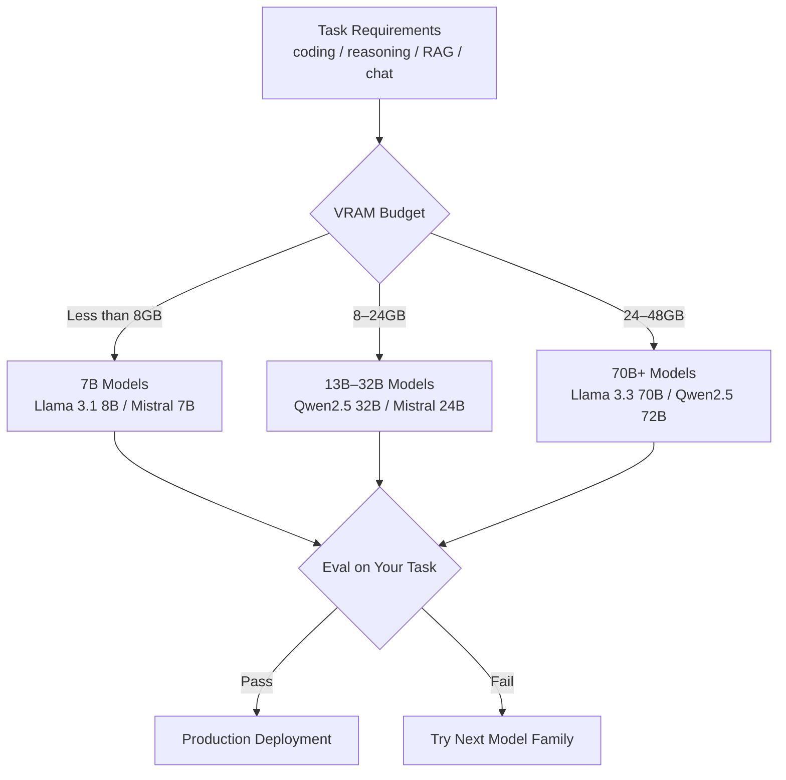

# Best Open Source LLMs Compared: Llama vs Mistral vs Qwen (2026)

Choosing an open source LLM for production is harder than it looks from the outside. The leaderboard changes every few months, model names are inconsistently versioned, and benchmark scores on academic datasets do not always translate into real-world task performance. I have spent considerable time running these models against actual production workloads — code generation, RAG pipelines, structured extraction, and multi-turn chat — and the results are consistently more nuanced than any public benchmark table shows.

The practical question is not which model scores highest on MMLU. It is which model reliably produces the right output format for your application, handles edge cases gracefully, fits within your hardware budget, and does not regress when you update your prompts. That is what this comparison addresses.

I will cover the five model families that matter most for production use in early 2026: Llama 3.3, Mistral, Qwen 2.5, Phi-4, and Gemma 3. For each, I will give benchmark context, practical strengths and weaknesses, hardware requirements, and the Ollama commands to get started immediately.

---

## Concept Overview

Open source model selection has two distinct dimensions that engineers often conflate: raw capability and fit-for-purpose.

Raw capability is what benchmarks measure: general reasoning, math, coding, instruction following across a diverse test set. Fit-for-purpose is whether the model reliably does your specific task on your specific data with your specific prompt. A model that scores 85 on MMLU might be terrible at extracting structured JSON from your domain-specific documents if it was not well-represented in the training mix.

The decision framework I use has three gates:
1. Does the model fit my hardware? (VRAM / RAM constraint)
2. Does it pass a spot-check on my actual task? (10–20 representative examples)
3. Does it hold up on edge cases and adversarial inputs?

Only after all three gates pass does a model go to production. The comparison below focuses on what matters at each gate.

---

## How It Works



---

## Benchmark Reference

The benchmarks below are from public evaluations. Treat these as directional signals, not definitive rankings — your internal evals matter more.

| Model | MMLU | HumanEval | MT-Bench | MATH | Params |
|---|---|---|---|---|---|
| Llama 3.3 70B Instruct | 86.0 | 88.4 | 9.1 | 77.0 | 70B |
| Qwen2.5 72B Instruct | 87.2 | 86.8 | 9.2 | 83.1 | 72B |
| Mistral Small 3 (24B) | 81.0 | 78.2 | 8.6 | 65.0 | 24B |
| Qwen2.5 32B Instruct | 83.5 | 79.1 | 8.8 | 74.0 | 32B |
| Phi-4 (14B) | 84.8 | 82.6 | 8.9 | 80.4 | 14B |
| Gemma 3 27B IT | 79.5 | 72.0 | 8.4 | 62.0 | 27B |
| Llama 3.1 8B Instruct | 73.0 | 72.6 | 8.2 | 48.0 | 8B |
| Mistral 7B Instruct v0.3 | 64.2 | 58.4 | 7.6 | 35.0 | 7B |

One thing many developers overlook is the MATH benchmark. It is the most discriminating for reasoning quality and correlates well with multi-step task performance in production. Phi-4 and Qwen2.5 72B perform exceptionally here for their respective size classes.

---

## Implementation Example

### Pulling and Testing Models with Ollama

```bash
# Pull all five families for comparison
ollama pull llama3.3:70b-instruct-q4_K_M
ollama pull mistral:7b-instruct
ollama pull mistral-small:24b-instruct-2501
ollama pull qwen2.5:32b
ollama pull phi4:14b
ollama pull gemma3:27b

# Quick capability check
ollama run llama3.3:70b-instruct-q4_K_M \
  "Write a Python function that parses ISO 8601 timestamps with timezone handling. Include error cases."
```

### Python Multi-Model Evaluation Framework

```python
import ollama
import time
from dataclasses import dataclass
from typing import Optional

@dataclass
class EvalResult:
    model: str
    prompt: str
    response: str
    latency_seconds: float
    tokens_per_second: Optional[float]

def evaluate_model(model: str, prompt: str, system: str = "") -> EvalResult:
    """Run a single prompt against a model and capture timing."""
    messages = []
    if system:
        messages.append({"role": "system", "content": system})
    messages.append({"role": "user", "content": prompt})

    start = time.time()
    response = ollama.chat(model=model, messages=messages)
    elapsed = time.time() - start

    content = response["message"]["content"]
    # Rough token estimate (4 chars ≈ 1 token)
    tokens = len(content) / 4
    tps = tokens / elapsed if elapsed > 0 else 0

    return EvalResult(
        model=model,
        prompt=prompt,
        response=content,
        latency_seconds=round(elapsed, 2),
        tokens_per_second=round(tps, 1)
    )

# Define test cases representative of your actual workload
test_cases = [
    {
        "name": "JSON Extraction",
        "prompt": """Extract the following fields from this order email into JSON:
name, email, product, quantity, shipping_address.

Email: "Hi, I'm Jane Smith (jane@example.com). I'd like to order 3 units of
the Pro Widget (SKU-4821) shipped to 123 Main St, Austin TX 78701."

Return only valid JSON, no explanation.""",
    },
    {
        "name": "Code Generation",
        "prompt": "Write a Python async function that retries an HTTP request up to 3 times with exponential backoff. Use aiohttp. Include type hints.",
    },
    {
        "name": "Reasoning",
        "prompt": "A company has 3 teams. Team A completes a project in 6 days, Team B in 4 days, Team C in 12 days. How many days does it take all three working together? Show your work.",
    }
]

models = [
    "llama3.3:70b-instruct-q4_K_M",
    "qwen2.5:32b",
    "phi4:14b",
    "mistral-small:24b-instruct-2501",
]

for test in test_cases:
    print(f"\n{'='*60}")
    print(f"Test: {test['name']}")
    print(f"{'='*60}")
    for model in models:
        result = evaluate_model(model, test["prompt"])
        print(f"\n[{model}] ({result.latency_seconds}s, ~{result.tokens_per_second} tok/s)")
        print(result.response[:400])
```

---

## Model-by-Model Analysis

### Llama 3.3 70B Instruct — Best All-Rounder

Llama 3.3 70B is the default recommendation for production workloads where you have the hardware budget. It is the most well-tested open source model, has the largest community, and is the implicit baseline that most papers and tutorials reference.

**Strengths:** Instruction following, code generation, multi-turn dialogue, RAG retrieval and synthesis. Robust across prompt variations — less brittle than some alternatives.

**Weaknesses:** Requires 40–48GB VRAM at Q4 quantization. Not competitive with Qwen2.5 72B on coding benchmarks. Weaker than Phi-4 on structured math reasoning.

**Best for:** General-purpose production systems, RAG pipelines, customer-facing chat applications.

```bash
ollama pull llama3.3:70b-instruct-q4_K_M
```

### Mistral 7B / Small 24B — Efficiency Champions

Mistral 7B v0.3 is the most permissively licensed serious model (Apache 2.0, no usage restrictions). For applications where license compliance matters and capability requirements are moderate, it remains an excellent choice.

Mistral Small 3 (24B) is where Mistral currently shines. At 24B parameters, it performs significantly better than the 7B on complex tasks while fitting in 16GB VRAM at Q4 — a sweet spot for mid-tier hardware.

**Strengths:** Apache 2.0 license is the cleanest for commercial use. Efficient inference. Mistral models tend to produce tighter, less verbose outputs than Llama equivalents.

**Weaknesses:** Math and complex reasoning notably weaker than Llama 3.3 70B at equivalent size. Less community tooling and fine-tuned variants available.

**Best for:** Cost-sensitive production deployments, applications where Apache 2.0 licensing is required, and scenarios where output verbosity is a concern.

```bash
ollama pull mistral:7b-instruct       # ~4GB, any GPU
ollama pull mistral-small:24b-instruct-2501  # ~14GB Q4
```

### Qwen 2.5 72B — Best for Coding and Math

Qwen 2.5 from Alibaba is the model family I recommend specifically for coding-heavy workloads. The 72B model outperforms Llama 3.3 70B on HumanEval and MATH, and the 32B model at Q4 fits in 20GB VRAM while punching significantly above its weight.

In practice, Qwen 2.5 also handles structured output (JSON mode, function calling) more reliably than Llama equivalents in my testing. The failure rate on malformed JSON is meaningfully lower.

**Strengths:** Best-in-class coding, strong math reasoning, excellent multilingual support (strongest for CJK languages), reliable structured output.

**Weaknesses:** License (Apache 2.0 for most sizes) is good, but the model family is less battle-tested in Western production deployments. Slightly more verbose than Mistral.

**Best for:** Code generation assistants, mathematical reasoning tasks, multilingual applications, any pipeline that relies on structured JSON output.

```bash
ollama pull qwen2.5:32b        # ~20GB Q4
ollama pull qwen2.5:72b        # ~44GB Q4
ollama pull qwen2.5-coder:32b  # Specialized code model
```

### Phi-4 (14B) — Best Reasoning per VRAM Dollar

Phi-4 challenges the assumption that bigger is always better. At 14B parameters, it achieves benchmark performance that rivals 34B models on reasoning and STEM tasks, because Microsoft trained it on curated synthetic data rather than web-scale noisy data.

A common mistake I have seen in production systems is dismissing Phi-4 because "it is only 14B." For applications centered on structured reasoning, math, or technical Q&A, Phi-4 is often the right choice — and it runs comfortably on an RTX 4080 (16GB VRAM).

**Strengths:** Exceptional reasoning and math performance for model size, fits in 10GB VRAM at Q4, fast inference, great STEM task accuracy.

**Weaknesses:** Weaker on open-ended creative generation and knowledge-breadth tasks. Less effective for casual conversation compared to larger models.

**Best for:** Technical assistants, math tutoring, scientific Q&A, reasoning-intensive pipelines where hardware is constrained.

```bash
ollama pull phi4:14b  # ~9GB Q4
```

### Gemma 3 27B — Google's Production-Ready Option

Gemma 3 27B is a solid, well-documented model with Google's backing. It is not the top performer in any specific category, but it is consistently competent, well-aligned, and integrates well with Google's toolchain if you are already in that ecosystem.

**Strengths:** Strong instruction following, good at avoiding refusals on legitimate requests, excellent documentation and model card detail from Google.

**Weaknesses:** Benchmark performance trails Llama 3.3 70B and Qwen2.5 72B at equivalent compute. The 27B model is an awkward size — it requires similar VRAM to Qwen 32B but underperforms it.

**Best for:** Teams in the Google ecosystem, applications needing strong alignment and refusal-calibration, general chat applications where consistency matters more than peak capability.

```bash
ollama pull gemma3:27b  # ~17GB Q4
```

---

## Decision Table

| Use Case | Recommended Model | Runner-up |
|---|---|---|
| General production chat | Llama 3.3 70B | Mistral Small 24B |
| Code generation | Qwen2.5 Coder 32B | Llama 3.3 70B |
| RAG pipeline | Llama 3.3 70B | Qwen2.5 32B |
| Math / reasoning | Phi-4 14B | Qwen2.5 72B |
| Multilingual | Qwen2.5 72B | Mistral Small 24B |
| Budget hardware (8GB VRAM) | Phi-4 14B | Llama 3.1 8B |
| Apache 2.0 license required | Mistral 7B | Qwen2.5 |
| Instruction following | Llama 3.3 70B | Qwen2.5 72B |
| Structured output (JSON) | Qwen2.5 32B | Llama 3.3 70B |

---

## Best Practices

**Evaluate on your own data, not public benchmarks.** Public benchmarks are increasingly saturated — models are trained on data that overlaps with evaluation sets. Build a small internal eval set of 50–100 representative examples from your production workload and use that as your primary selection criterion.

**Test prompt sensitivity across models.** Some models are much more sensitive to prompt phrasing than others. A prompt that works perfectly on Qwen2.5 might produce inconsistent results on Mistral with the same content. Always test multiple prompt variants.

**Account for context window differences.** Llama 3.3 and Qwen2.5 support 128k context windows. Mistral 7B v0.3 supports 32k. Gemma 3 varies by size. For RAG pipelines with long documents, this matters significantly.

**Run structured output benchmarks separately.** If your application depends on the model producing valid JSON or following a schema, benchmark this explicitly. General benchmark scores are a poor predictor of structured output reliability.

---

## Common Mistakes

1. **Comparing base models to instruct-tuned models.** Always use the instruct or chat-tuned variant for production applications. Base models require different prompting strategies.

2. **Ignoring the quantization level in model names.** `qwen2.5:32b` on Ollama pulls a specific default quantization. Know which quant level you are running — it materially affects both quality and VRAM usage.

3. **Trusting MT-Bench scores for production chat quality.** MT-Bench is a good signal but is evaluated by GPT-4, which introduces bias toward GPT-4's stylistic preferences. It underrates models that are more concise.

4. **Not testing temperature sensitivity.** Some models are much more sensitive to temperature settings than others. Qwen models can produce repetitive output at high temperatures. Always test with your intended temperature setting.

5. **Benchmarking on a single example per category.** One example is an anecdote. Thirty examples is a weak signal. One hundred examples is the minimum for a statistically meaningful comparison.

---

## Summary

For 2026 production workloads, Llama 3.3 70B remains the default recommendation for general-purpose use when hardware permits. Qwen 2.5 is the clear winner for coding-heavy and multilingual use cases. Phi-4 is the smart choice for reasoning-intensive tasks on constrained hardware. Mistral is the pragmatic choice when Apache 2.0 licensing is a hard requirement.

None of these recommendations is permanent — this ecosystem moves fast. Re-evaluate your model selection every quarter against your internal eval set.

---

## Related Articles

- [Open Source LLMs Guide: Complete Ecosystem Overview](/blog/open-source-llm-guide)
- [LLM Quantization Explained: Run Bigger Models on Less Hardware](/blog/llm-quantization)
- [Running LLMs Locally with Ollama: Complete Guide](/blog/ollama-tutorial)
- [LLM Benchmarks Explained](/blog/llm-benchmarks)

---

## FAQ

**Q: Is Llama 3.3 70B still the best open source model?**
It is one of the best general-purpose models, but Qwen2.5 72B now outperforms it on coding and math. The "best" depends heavily on your use case — there is no single winner across all dimensions.

**Q: Can Mistral 7B handle production workloads?**
For moderate complexity tasks — classification, summarization, Q&A, structured extraction — yes. For complex reasoning chains, multi-step coding, or tasks requiring broad knowledge synthesis, you will want at least a 24B model.

**Q: How often do I need to re-evaluate my model choice?**
Every 2–3 months in this ecosystem. Run a small eval set against new releases as they appear. Model updates can meaningfully change behavior even at the same model family and size.

**Q: Should I use quantized models in production?**
Yes, Q4_K_M or Q5_K_M quantized models are appropriate for most production workloads. The quality difference from full-precision is marginal for the majority of tasks.

<script type="application/ld+json">
{
  "@context": "https://schema.org",
  "@type": "FAQPage",
  "mainEntity": [
    {
      "@type": "Question",
      "name": "Is Llama 3.3 70B still the best open source model?",
      "acceptedAnswer": {
        "@type": "Answer",
        "text": "It is one of the best general-purpose models, but Qwen2.5 72B now outperforms it on coding and math. The best model depends on your specific use case."
      }
    },
    {
      "@type": "Question",
      "name": "Can Mistral 7B handle production workloads?",
      "acceptedAnswer": {
        "@type": "Answer",
        "text": "For moderate complexity tasks like classification, summarization, and structured extraction, yes. For complex reasoning chains or multi-step coding, you will want at least a 24B model."
      }
    },
    {
      "@type": "Question",
      "name": "How often do I need to re-evaluate my model choice?",
      "acceptedAnswer": {
        "@type": "Answer",
        "text": "Every 2–3 months in this ecosystem. Run a small eval set against new releases as they appear."
      }
    },
    {
      "@type": "Question",
      "name": "Should I use quantized models in production?",
      "acceptedAnswer": {
        "@type": "Answer",
        "text": "Yes, Q4_K_M or Q5_K_M quantized models are appropriate for most production workloads. The quality difference from full-precision is marginal for the majority of tasks."
      }
    }
  ]
}
</script>
