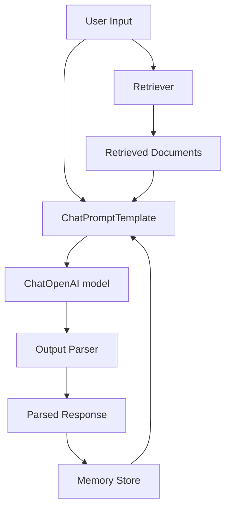

# Building AI Apps with OpenAI and LangChain

The most common question I get from developers starting with LangChain is: "Why use LangChain at all? I can just call the OpenAI API directly." It is a legitimate question, and the honest answer is: for simple use cases, raw API is often the right choice. LangChain adds value when your application involves multiple steps — retrieve context, inject into prompt, call LLM, parse output, store result — and you want a structured way to compose and test those steps without writing boilerplate glue code.

Where LangChain has historically struggled is in production reliability. The early versions of LangChain had unstable APIs, verbose abstractions, and made debugging difficult. LangChain Expression Language (LCEL), introduced in 2023 and matured by 2025, addresses most of these problems. LCEL provides a composable, streaming-native, observable pipeline syntax that makes it practical for real applications.

This guide covers the OpenAI + LangChain integration with a focus on what actually works in production: ChatOpenAI, LCEL chains, memory management, tool integration, and building a real document Q&A application.

---

## Concept Overview

**LangChain** is a framework for composing LLM-powered application pipelines. It provides:

- **Model wrappers** (`ChatOpenAI`, `ChatAnthropic`) — Consistent interface across providers
- **Prompt templates** — Reusable, typed prompt construction
- **LCEL (LangChain Expression Language)** — `|` operator for composing pipeline steps
- **Memory** — Conversation history management
- **Retrievers** — Document retrieval for RAG
- **Tools and agents** — Tool-using agent patterns
- **LangSmith integration** — Observability and tracing

**When LangChain adds value:**
- RAG pipelines (retrieval → prompt → generation → parsing)
- Multi-step agents with tool use
- Applications that need to swap between models easily
- Teams that want standardized observability via LangSmith

**When raw API is better:**
- Simple single-step completions
- Performance-critical paths where abstraction overhead matters
- Applications with unusual streaming requirements
- Teams who prefer minimal dependencies

---

## How It Works



LCEL chains are built with the `|` pipe operator. Each component is a `Runnable` with `.invoke()`, `.stream()`, and `.batch()` methods. This uniformity means you can swap any component without changing the rest of the chain.

---

## Implementation Example

### Installation

```bash
pip install langchain langchain-openai langchain-community faiss-cpu
```

### ChatOpenAI — The Foundation

```python
from langchain_openai import ChatOpenAI
from langchain_core.messages import HumanMessage, SystemMessage

# Initialize model — similar to OpenAI client but with LangChain interface
llm = ChatOpenAI(
    model="gpt-4o-mini",
    temperature=0,
    max_tokens=1024,
    # api_key read from OPENAI_API_KEY env var
)

# Direct invocation
response = llm.invoke([
    SystemMessage(content="You are a concise Python expert."),
    HumanMessage(content="What is the difference between a list and a tuple?")
])
print(response.content)
print(f"Tokens used: {response.usage_metadata}")
```

### Prompt Templates

```python
from langchain_core.prompts import ChatPromptTemplate, MessagesPlaceholder

# Reusable prompt template
code_review_prompt = ChatPromptTemplate.from_messages([
    ("system", """You are an expert Python code reviewer.
Review the provided code for:
- Correctness and logic errors
- Performance issues
- Security vulnerabilities
- PEP 8 compliance
Be specific and actionable. Format as a numbered list."""),
    ("human", "Review this code:\n\n```python\n{code}\n```")
])

# Template with conversation history placeholder
chat_prompt = ChatPromptTemplate.from_messages([
    ("system", "You are a helpful {role}. Be concise and accurate."),
    MessagesPlaceholder(variable_name="history"),
    ("human", "{input}")
])
```

### LCEL Chains

```python
from langchain_core.output_parsers import StrOutputParser
from langchain_core.prompts import ChatPromptTemplate

# Basic LCEL chain: prompt | model | parser
code_chain = (
    code_review_prompt
    | ChatOpenAI(model="gpt-4o-mini", temperature=0)
    | StrOutputParser()
)

# Invoke
review = code_chain.invoke({
    "code": """
def find_user(users, name):
    for i in range(len(users)):
        if users[i]['name'] == name:
            return users[i]
"""
})
print(review)

# Stream
for chunk in code_chain.stream({"code": "x = [i for i in range(1000000)]"}):
    print(chunk, end="", flush=True)

# Batch — process multiple items efficiently
reviews = code_chain.batch([
    {"code": "import *"},
    {"code": "password = 'admin123'"},
])
```

### Structured Output

```python
from langchain_openai import ChatOpenAI
from pydantic import BaseModel, Field
from typing import Optional

class CodeReview(BaseModel):
    """Structured code review output."""
    severity: str = Field(description="Overall severity: critical/major/minor/pass")
    issues: list[str] = Field(description="List of specific issues found")
    suggestions: list[str] = Field(description="Actionable improvement suggestions")
    estimated_fix_time: Optional[str] = Field(description="Rough time to fix all issues")

# Structured output via .with_structured_output()
structured_llm = ChatOpenAI(model="gpt-4o-mini").with_structured_output(CodeReview)

structured_prompt = ChatPromptTemplate.from_messages([
    ("system", "You are a code reviewer. Analyze the code and provide structured feedback."),
    ("human", "Review:\n```python\n{code}\n```")
])

structured_chain = structured_prompt | structured_llm

result = structured_chain.invoke({"code": "def calc(x): return x*x*x"})
print(f"Severity: {result.severity}")
print(f"Issues: {result.issues}")
print(f"Suggestions: {result.suggestions}")
```

### Memory Management

```python
from langchain_core.chat_history import BaseChatMessageHistory
from langchain_core.messages import AIMessage, HumanMessage
from langchain_core.runnables.history import RunnableWithMessageHistory
from langchain_openai import ChatOpenAI

# In-memory chat history store (replace with Redis/database for production)
store: dict = {}

def get_session_history(session_id: str) -> BaseChatMessageHistory:
    from langchain_community.chat_message_histories import ChatMessageHistory
    if session_id not in store:
        store[session_id] = ChatMessageHistory()
    return store[session_id]

# Base chain
base_prompt = ChatPromptTemplate.from_messages([
    ("system", "You are a helpful Python tutor. Be concise."),
    MessagesPlaceholder(variable_name="history"),
    ("human", "{input}")
])

base_chain = base_prompt | ChatOpenAI(model="gpt-4o-mini") | StrOutputParser()

# Wrap with memory
chain_with_memory = RunnableWithMessageHistory(
    base_chain,
    get_session_history,
    input_messages_key="input",
    history_messages_key="history"
)

# Use session_id to maintain separate conversations per user
config = {"configurable": {"session_id": "user-123"}}

print(chain_with_memory.invoke({"input": "What is list comprehension?"}, config=config))
print(chain_with_memory.invoke({"input": "Can you show an example with filtering?"}, config=config))
print(chain_with_memory.invoke({"input": "How does this differ from filter()?"}, config=config))
```

### Document Q&A Application (Complete Example)

This is the most common LangChain use case — RAG over your own documents.

```python
from langchain_openai import ChatOpenAI, OpenAIEmbeddings
from langchain_community.document_loaders import PyPDFLoader, TextLoader
from langchain.text_splitter import RecursiveCharacterTextSplitter
from langchain_community.vectorstores import FAISS
from langchain_core.prompts import ChatPromptTemplate
from langchain_core.output_parsers import StrOutputParser
from langchain_core.runnables import RunnablePassthrough
from pathlib import Path
import os

class DocumentQA:
    """RAG-based document Q&A system built with LangChain + OpenAI."""

    def __init__(self, model: str = "gpt-4o-mini"):
        self.embeddings = OpenAIEmbeddings(model="text-embedding-3-small")
        self.llm = ChatOpenAI(model=model, temperature=0)
        self.vectorstore = None
        self.retriever = None

        self.prompt = ChatPromptTemplate.from_messages([
            ("system", """You are a precise assistant that answers questions based only on the provided context.
If the answer is not in the context, say "I cannot find this in the provided documents."
Do not make up information or use external knowledge.

Context:
{context}"""),
            ("human", "{question}")
        ])

    def load_documents(self, file_paths: list[str]) -> int:
        """Load and index documents from file paths."""
        documents = []

        for path in file_paths:
            if path.endswith(".pdf"):
                loader = PyPDFLoader(path)
            else:
                loader = TextLoader(path)
            documents.extend(loader.load())

        # Split into chunks
        splitter = RecursiveCharacterTextSplitter(
            chunk_size=1000,
            chunk_overlap=200,
            separators=["\n\n", "\n", ". ", " "]
        )
        chunks = splitter.split_documents(documents)

        # Create vector store
        self.vectorstore = FAISS.from_documents(chunks, self.embeddings)
        self.retriever = self.vectorstore.as_retriever(
            search_kwargs={"k": 4}  # Return top 4 chunks
        )

        print(f"Indexed {len(chunks)} chunks from {len(documents)} documents")
        return len(chunks)

    def _format_docs(self, docs) -> str:
        """Format retrieved documents into a single context string."""
        formatted = []
        for i, doc in enumerate(docs, 1):
            source = doc.metadata.get("source", "Unknown")
            page = doc.metadata.get("page", "")
            header = f"[Document {i} — {Path(source).name}{f', page {page}' if page else ''}]"
            formatted.append(f"{header}\n{doc.page_content}")
        return "\n\n---\n\n".join(formatted)

    def build_chain(self):
        """Build the RAG chain using LCEL."""
        self.chain = (
            {
                "context": self.retriever | self._format_docs,
                "question": RunnablePassthrough()
            }
            | self.prompt
            | self.llm
            | StrOutputParser()
        )

    def ask(self, question: str) -> str:
        """Answer a question using retrieved context."""
        if not self.chain:
            self.build_chain()
        return self.chain.invoke(question)

    def ask_with_sources(self, question: str) -> dict:
        """Answer a question and return sources."""
        # Get retrieved documents separately
        docs = self.retriever.invoke(question)
        sources = [
            {
                "source": doc.metadata.get("source", "Unknown"),
                "page": doc.metadata.get("page", "N/A"),
                "preview": doc.page_content[:200] + "..."
            }
            for doc in docs
        ]

        answer = self.ask(question)
        return {"answer": answer, "sources": sources}


# Usage
qa = DocumentQA(model="gpt-4o-mini")

# Load your documents
chunk_count = qa.load_documents([
    "./engineering_spec.pdf",
    "./api_documentation.txt"
])

qa.build_chain()

# Simple Q&A
answer = qa.ask("What authentication method does the API use?")
print(answer)

# Q&A with sources
result = qa.ask_with_sources("What are the rate limits?")
print(f"Answer: {result['answer']}")
print(f"Sources: {[s['source'] for s in result['sources']]}")
```

---

## Raw API vs LangChain: When to Choose Each

| Consideration | Raw API | LangChain |
|--------------|---------|-----------|
| Simple completions | Simpler | Over-engineered |
| RAG pipelines | Verbose boilerplate | Clean composition |
| Multi-provider support | Manual | Built-in |
| Streaming | Straightforward | Uniform `.stream()` |
| Observability | Manual logging | LangSmith integration |
| Debugging | Transparent | Can obscure errors |
| Dependencies | Minimal | Heavy |
| Customization | Full control | Limited by abstractions |

In practice, many teams use LangChain for prototyping and initial builds, then selectively replace components with direct API calls in performance-critical paths.

---

## Best Practices

**Use LCEL over legacy chain classes.** `LLMChain`, `SequentialChain`, and `ConversationalRetrievalChain` are legacy patterns. LCEL with `|` composition is more readable, testable, and streaming-native. Avoid the legacy classes in new code.

**Enable LangSmith in production.** Set `LANGCHAIN_API_KEY` and `LANGCHAIN_TRACING_V2=true` environment variables. LangSmith traces every chain invocation, shows token usage per step, and lets you replay and debug failures. It is the most valuable tool for debugging LangChain applications.

**Test individual chain components.** LCEL chains are composable, which means each step can be tested independently. Test your retriever, your prompt template rendering, and your output parser separately before testing the full chain.

**Store conversation history in a database.** The in-memory `ChatMessageHistory` is convenient for development but does not persist across server restarts. Use `RedisChatMessageHistory` or a custom database-backed implementation for production.

---

## Common Mistakes

1. **Using LangChain for simple one-shot completions.** If your use case is a single API call, the raw `openai` SDK is simpler and has no overhead. Reserve LangChain for multi-step pipelines.

2. **Ignoring LCEL in favor of legacy classes.** Legacy chain classes like `LLMChain` are harder to debug and do not support streaming natively. LCEL is the right abstraction for 2025+.

3. **Not using `RunnableWithMessageHistory` for session isolation.** Each user should have their own session ID and message history. Using a global history object causes users to see each other's conversations.

4. **Over-relying on LangChain's default splitters without tuning.** The default `RecursiveCharacterTextSplitter` parameters (chunk size 1000, overlap 200) are starting points, not optimal for all documents. Tune chunk size for your specific document structure and retrieval task.

5. **Not logging chain latency by step.** When a chain is slow, you need to know which step is responsible. LangSmith traces each step. Without it, you are guessing.

---

## Summary

LangChain with LCEL provides a clean, composable way to build multi-step LLM applications. The `ChatOpenAI` wrapper provides a consistent interface, prompt templates make prompts reusable and testable, and LCEL chains compose retrieval, generation, and parsing into readable pipelines. The document Q&A pattern — load, chunk, embed, retrieve, generate — is the most common real-world use case and a template for most RAG applications. Use LangChain when the composition and observability benefits outweigh the added dependency and abstraction cost.

---

## Related Articles

- [LLM APIs Guide for Developers](/blog/llm-api-guide/)
- [RAG Architecture Guide](/blog/rag-architecture-guide/)
- [OpenAI API Tutorial for Developers](/blog/openai-api-tutorial/)
- [How LLMs Work](/blog/how-llms-work/)

---

## FAQ

**Q: Is LangChain still worth using in 2026?**

Yes, but more selectively than in 2023–2024. LCEL is solid for RAG pipelines and multi-step chains. The ecosystem has matured. The main caveat: for simple use cases, raw API calls are still simpler. Use LangChain when you need the composition, memory, or retriever abstractions.

**Q: What is LCEL and how is it different from the old LangChain chains?**

LCEL (LangChain Expression Language) uses the `|` operator to compose runnables. Every component — prompts, models, parsers, retrievers — implements the same `Runnable` interface with `.invoke()`, `.stream()`, `.batch()`. Old chains like `LLMChain` were class-based and did not support streaming natively. LCEL is the current recommended pattern.

**Q: Can I use LangChain with Anthropic and Gemini too?**

Yes. Install `langchain-anthropic` or `langchain-google-genai` and swap `ChatOpenAI` for `ChatAnthropic` or `ChatGoogleGenerativeAI`. The rest of your LCEL chain stays the same — that provider-agnostic interface is one of LangChain's primary value propositions.

**Q: How do I switch from LangChain back to the raw API for a specific part of my chain?**

You can wrap any function in `RunnableLambda` to make it LCEL-compatible: `RunnableLambda(my_function)`. This lets you mix raw API calls with LangChain components in the same chain. Useful for performance-critical steps where you want direct SDK access.

---

<script type="application/ld+json">
{
  "@context": "https://schema.org",
  "@type": "FAQPage",
  "mainEntity": [
    {
      "@type": "Question",
      "name": "Is LangChain still worth using in 2026?",
      "acceptedAnswer": {
        "@type": "Answer",
        "text": "Yes, but more selectively. LCEL is solid for RAG pipelines and multi-step chains. For simple use cases, raw API calls are simpler. Use LangChain when you need composition, memory, or retriever abstractions."
      }
    },
    {
      "@type": "Question",
      "name": "What is LCEL and how is it different from the old LangChain chains?",
      "acceptedAnswer": {
        "@type": "Answer",
        "text": "LCEL uses the | operator to compose runnables. Every component implements the same Runnable interface with .invoke(), .stream(), .batch(). Old chains like LLMChain were class-based and did not support streaming natively."
      }
    },
    {
      "@type": "Question",
      "name": "Can I use LangChain with Anthropic and Gemini too?",
      "acceptedAnswer": {
        "@type": "Answer",
        "text": "Yes. Install langchain-anthropic or langchain-google-genai and swap ChatOpenAI for ChatAnthropic or ChatGoogleGenerativeAI. The rest of your LCEL chain stays the same."
      }
    }
  ]
}
</script>
