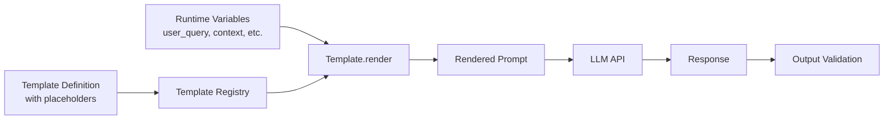

# Prompt Templates for AI Applications

The first AI feature I saw break in production was a customer-facing chatbot. The prompt was embedded as a multi-line f-string inside the request handler — 400 lines into a 2,000-line file. When a bug appeared, no one could find the prompt. When they found it, they couldn't test changes without deploying. When they deployed, they had no way to revert.

Prompt templates solve this. They are the pattern that turns ad hoc prompt strings into maintainable, testable, versioned engineering artifacts. If you are building anything beyond a prototype, you need prompt templates.

## Concept Overview

A prompt template is a parameterized prompt with named placeholders for variable inputs. Instead of assembling prompts by string concatenation at the call site, you define the structure once and fill in variables at runtime.

The benefits compound at scale. Templates make prompts testable in isolation, easy to version, and shareable across teams. They make it possible to run A/B tests on prompt variants, to monitor prompt performance, and to migrate to new models by updating a single definition rather than hunting through application code.

In practice, there are three levels of prompt template maturity:

1. **Basic**: Python string templates with named placeholders
2. **Structured**: Dataclass or Pydantic-backed templates with validation
3. **Framework**: LangChain PromptTemplate with input validation and serialization

## How It Works



The template registry is the key architectural piece. Rather than templates scattered across service files, they live in a central location with names, versions, and metadata. The calling code references a template by name, not by value.

## Implementation Example

### Level 1: Simple String Templates

```python
from string import Template

# ─── Basic parameterized templates ────────────────────────────────────────────
SUMMARIZE_TEMPLATE = Template("""Summarize the following $content_type for a $audience audience.

Requirements:
- $max_points bullet points maximum
- Focus on $focus
- Avoid $avoid

Content:
$content

Summary:""")

# Render
prompt = SUMMARIZE_TEMPLATE.substitute(
    content_type="engineering incident report",
    audience="VP-level non-technical",
    max_points="3",
    focus="business impact and resolution timeline",
    avoid="technical implementation details and specific error messages",
    content=incident_report_text
)
```

### Level 2: Structured Template Class

```python
from dataclasses import dataclass, field
from typing import Optional
import hashlib
import json
from openai import OpenAI

client = OpenAI()

@dataclass
class PromptTemplate:
    """
    A version-controlled, parameterized prompt template.
    """
    name: str
    version: str
    system: str
    user: str
    temperature: float = 0.0
    model: str = "gpt-4o"
    response_format: Optional[dict] = None
    description: str = ""
    input_variables: list[str] = field(default_factory=list)

    def render_system(self, **kwargs) -> str:
        """Render the system prompt with provided variables."""
        missing = [v for v in self.input_variables if v not in kwargs and f"{{{v}}}" in self.system]
        if missing:
            raise ValueError(f"Missing required variables for system prompt: {missing}")
        result = self.system
        for key, value in kwargs.items():
            result = result.replace(f"{{{key}}}", str(value))
        return result

    def render_user(self, **kwargs) -> str:
        """Render the user prompt with provided variables."""
        result = self.user
        for key, value in kwargs.items():
            result = result.replace(f"{{{key}}}", str(value))
        return result

    def invoke(self, **kwargs) -> str:
        """Render and invoke the template."""
        messages = [{"role": "system", "content": self.render_system(**kwargs)}]
        messages.append({"role": "user", "content": self.render_user(**kwargs)})

        response = client.chat.completions.create(
            model=self.model,
            messages=messages,
            temperature=self.temperature,
            response_format=self.response_format
        )
        return response.choices[0].message.content

    def checksum(self) -> str:
        """Detect unintentional prompt drift."""
        content = self.system + self.user
        return hashlib.sha256(content.encode()).hexdigest()[:8]

    def to_dict(self) -> dict:
        """Serialize for storage or logging."""
        return {
            "name": self.name,
            "version": self.version,
            "checksum": self.checksum(),
            "temperature": self.temperature,
            "model": self.model,
            "input_variables": self.input_variables
        }


# ─── Template Registry ────────────────────────────────────────────────────────
class TemplateRegistry:
    """Central store for all prompt templates."""

    def __init__(self):
        self._templates: dict[str, PromptTemplate] = {}

    def register(self, template: PromptTemplate):
        self._templates[template.name] = template

    def get(self, name: str) -> PromptTemplate:
        if name not in self._templates:
            raise KeyError(f"Template '{name}' not found. Available: {list(self._templates.keys())}")
        return self._templates[name]

    def list_all(self) -> list[dict]:
        return [t.to_dict() for t in self._templates.values()]


# ─── Define templates ─────────────────────────────────────────────────────────
registry = TemplateRegistry()

registry.register(PromptTemplate(
    name="ticket_classifier",
    version="2.0.0",
    description="Classifies support tickets into predefined categories",
    input_variables=["categories", "ticket"],
    system="""You are a support ticket classifier.

Classify the ticket into exactly one of these categories:
{categories}

Rules:
- Return ONLY valid JSON
- Use "low" confidence for ambiguous cases

Response schema:
{{"category": string, "confidence": "high"|"medium"|"low", "reason": string}}""",
    user="Ticket: {ticket}",
    temperature=0,
    response_format={"type": "json_object"}
))

registry.register(PromptTemplate(
    name="document_summarizer",
    version="1.3.0",
    description="Audience-targeted document summarization",
    input_variables=["audience", "focus", "max_words", "document"],
    system="""You are a professional writing assistant.
Summarize documents for the specified audience.
Be concise and focus on what matters to that audience.""",
    user="""Audience: {audience}
Focus on: {focus}
Maximum words: {max_words}

Document:
{document}

Summary:""",
    temperature=0.2
))

registry.register(PromptTemplate(
    name="code_explainer",
    version="1.1.0",
    description="Explains code for a specified experience level",
    input_variables=["language", "level", "code"],
    system="""You are a senior software engineer explaining code.
Adjust your explanation complexity to the developer's experience level.
- Junior: explain every concept, avoid assumed knowledge
- Mid: explain non-obvious patterns, skip basic syntax
- Senior: focus on architecture decisions and trade-offs""",
    user="""Language: {language}
Developer level: {level}

Code:
```{language}
{code}
```

Explanation:""",
    temperature=0.3
))


# ─── Usage ────────────────────────────────────────────────────────────────────
def classify_ticket(ticket_text: str) -> dict:
    import json
    template = registry.get("ticket_classifier")
    result = template.invoke(
        categories="billing, technical, feature_request, account, general",
        ticket=ticket_text
    )
    return json.loads(result)

def summarize_document(document: str, audience: str = "executive") -> str:
    template = registry.get("document_summarizer")
    return template.invoke(
        audience=audience,
        focus="business impact and key decisions",
        max_words="150",
        document=document
    )

def explain_code(code: str, language: str = "Python", level: str = "mid") -> str:
    template = registry.get("code_explainer")
    return template.invoke(language=language, level=level, code=code)
```

### Level 3: LangChain PromptTemplate

```python
from langchain.prompts import ChatPromptTemplate, SystemMessagePromptTemplate, HumanMessagePromptTemplate
from langchain_openai import ChatOpenAI

llm = ChatOpenAI(model="gpt-4o", temperature=0)

# ─── LangChain template with validation ───────────────────────────────────────
system_template = SystemMessagePromptTemplate.from_template("""
You are a {role} specializing in {domain}.
{additional_context}
Always respond in {output_language}.
""")

user_template = HumanMessagePromptTemplate.from_template("""
Task: {task}

Input:
{input_content}
""")

chat_prompt = ChatPromptTemplate.from_messages([system_template, user_template])

# Validate that all required variables are present before invoking
required_vars = chat_prompt.input_variables
print(f"Required variables: {required_vars}")

chain = chat_prompt | llm

result = chain.invoke({
    "role": "security engineer",
    "domain": "Python web application security",
    "additional_context": "Focus on OWASP Top 10 vulnerabilities.",
    "output_language": "English",
    "task": "Review the following code for security vulnerabilities",
    "input_content": "def get_user(id): return db.execute(f'SELECT * FROM users WHERE id={id}')"
})

print(result.content)
```

### Template Evaluation Harness

```python
def evaluate_template(template_name: str, test_cases: list[dict]) -> dict:
    """
    Run a template against a labeled test set.
    test_cases: [{"variables": dict, "expected_contains": str, "expected_not_contains": str}]
    """
    template = registry.get(template_name)
    results = {"passed": 0, "failed": 0, "failures": []}

    for case in test_cases:
        output = template.invoke(**case["variables"]).lower()
        passed = True
        reasons = []

        if "expected_contains" in case:
            if case["expected_contains"].lower() not in output:
                passed = False
                reasons.append(f"Missing: '{case['expected_contains']}'")

        if "expected_not_contains" in case:
            if case["expected_not_contains"].lower() in output:
                passed = False
                reasons.append(f"Should not contain: '{case['expected_not_contains']}'")

        if passed:
            results["passed"] += 1
        else:
            results["failed"] += 1
            results["failures"].append({
                "variables": case["variables"],
                "reasons": reasons,
                "output_preview": output[:200]
            })

    results["accuracy"] = results["passed"] / len(test_cases)
    results["template_version"] = template.version
    return results
```

## Best Practices

**Name templates after their function, not their implementation.** `ticket_classifier` is better than `gpt4_prompt_v3`. Names should be stable across model migrations.

**Version templates alongside application code.** A template change is a code change. Use semantic versioning: bump patch for wording improvements, minor for new variables, major for structural changes that may break callers.

**Validate required variables at render time, not at invocation time.** Catch missing variables before the API call — not from a cryptic LLM output.

**Store templates outside application logic.** A dedicated `prompts/` module or configuration file, not inline in service handlers. This makes them discoverable, testable, and migratable.

**Build a test case alongside every template.** Every template should have a corresponding set of test inputs and expected behaviors. Run these tests in CI on every prompt change.

**Log the template name and version with every LLM call.** When a production issue surfaces, you need to know which template version was in use at the time, not just the raw prompt text.

## Common Mistakes

**Templates with too many variables.** A template with 12 input variables is hard to call correctly and hard to test systematically. Split into smaller, focused templates.

**Hardcoding few-shot examples inside templates.** Examples should be separate from the template structure, or they become unmaintainable as requirements change. Store examples in a separate data structure and inject them.

**Not testing templates with edge case inputs.** Empty strings, very long inputs, special characters, and multilingual text all behave differently. Build your test set from real data.

**Mixing template versions in production.** If template version 1.0 and 1.1 are both active, you cannot reliably debug issues. Be intentional about which version is live.

## Summary

Prompt templates are how you turn experimental prompts into production-grade engineering artifacts. The pattern is straightforward: parameterize, centralize, version, and test. The productivity gains at scale — faster debugging, reliable A/B testing, safe model migrations — are significant.

Start with simple string templates. Graduate to a structured template class when you need versioning and validation. Use LangChain PromptTemplate when you are building pipelines that benefit from the broader ecosystem.

## Related Articles

- [Prompt Engineering Guide for AI Developers](/blog/prompt-engineering-guide/)
- [System Prompts: How to Control LLM Behavior](/blog/system-prompts-guide/)
- [Prompt Engineering Best Practices for Large Language Models](/blog/prompt-engineering-best-practices/)

## FAQ

**Should I use LangChain PromptTemplate or build my own?**
If you are already using LangChain, use its PromptTemplate — it integrates with chains, agents, and observability tooling. If you are not using LangChain, a simple dataclass template avoids the dependency overhead while providing the same core benefits.

**How do I handle templates that need different structures for different models?**
Maintain model-specific variants with the same name and different target model fields. Your registry can resolve the right variant based on the configured model. This keeps calling code model-agnostic.

**Can I serialize and store templates in a database?**
Yes. The `to_dict()` method in the implementation above is a starting point. Store name, version, system, user, input_variables, and metadata. This enables dynamic prompt management and A/B testing through a UI rather than code deployments.

**How should I handle secrets or PII in template variables?**
Never log the rendered prompt with PII-containing variables. Log the template name and version instead. If you need to debug a specific invocation, scrub PII from the input before logging.

**What's the best way to A/B test prompt templates?**
Assign a variant to each request using a deterministic hash of the user ID (for consistent user experience) or randomly (for unbiased measurement). Log the variant with every request and measure downstream metrics — not just LLM output quality but business metrics like resolution rate or user satisfaction.
